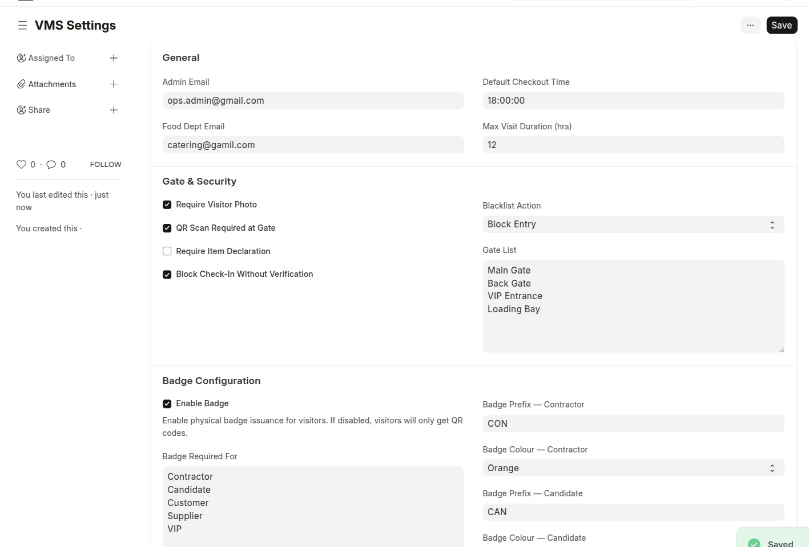
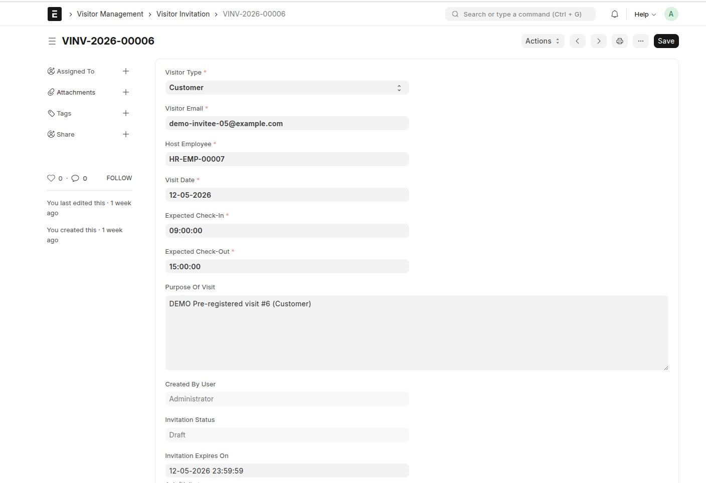
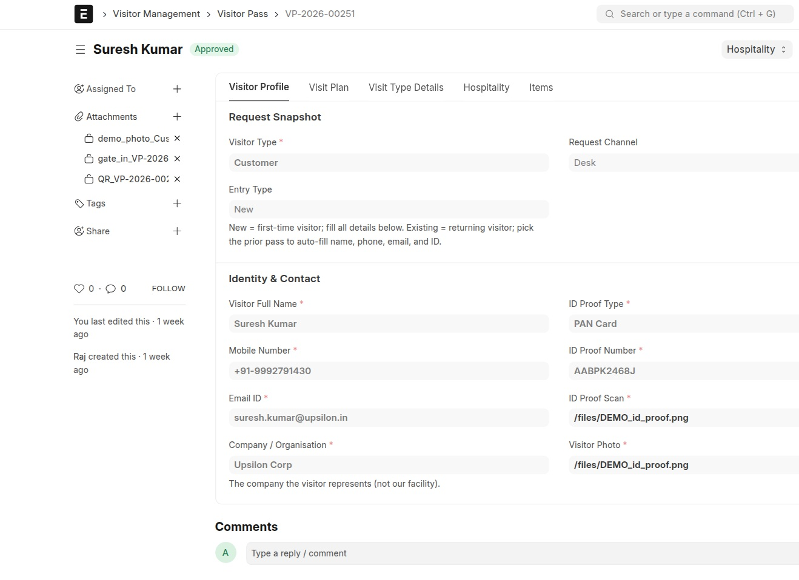
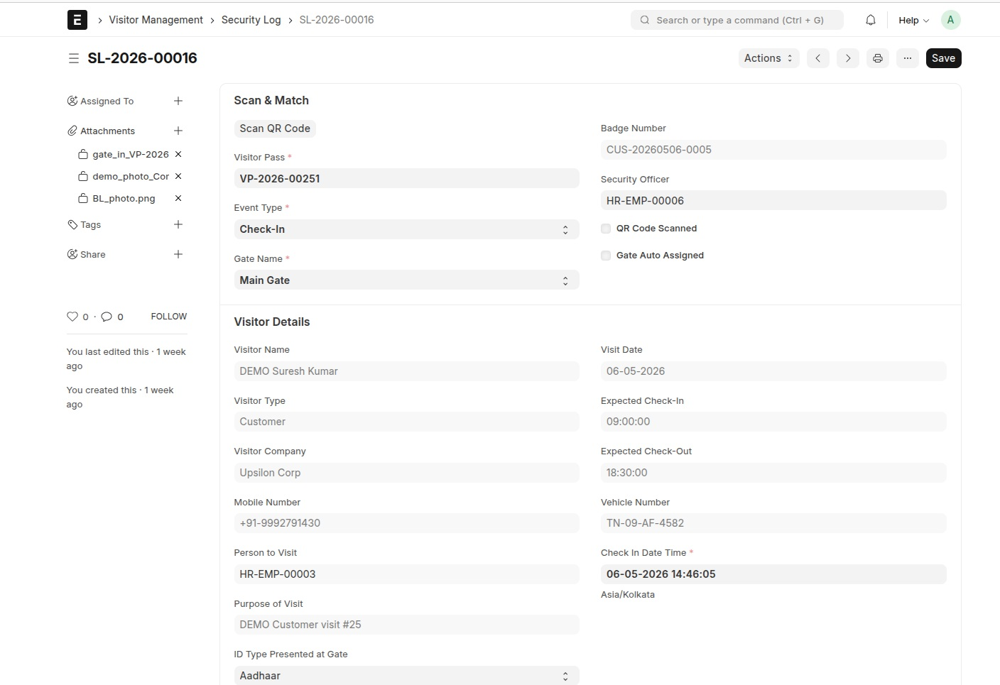
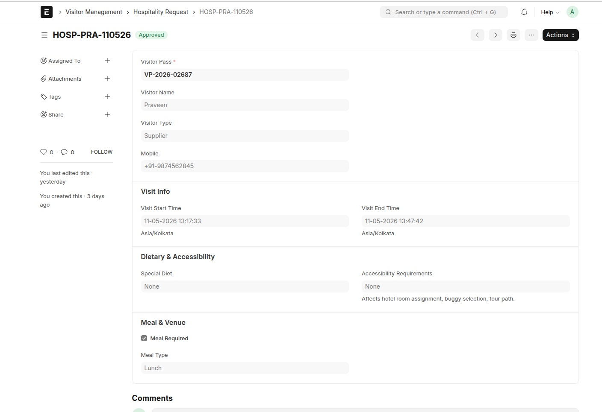
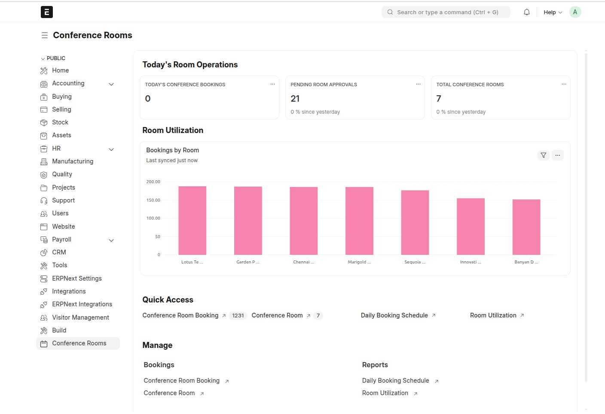

<div style="display: flex; justify-content: space-between; margin-bottom: 20px;">
    
    
</div>

---

# Visitor Management

Modern visitor lifecycle for offices, factories, and campuses — from pre-visit invitation, through QR-based gate check-in and identity verification, all the way to hospitality, conference rooms, contact tracing, and audit reports. Built on Frappe & ERPNext.

ERPNext 16  ·  Frappe 16  ·  license MIT

---

## Main features

**Visitor Lifecycle (invitation → approval → gate → checkout):** One Visitor Pass record drives the entire journey. Walk-in passes from reception or portal pre-registration via Visitor Invitation. Visitor type drives the approval workflow lane automatically.

**Gate Security & Identity Verification:** QR scan at the gate auto-loads the pass. A live photo is captured at the gate, **Matches ID Proof** and **Matches Pass Photo** must be ticked, the system screens against the active **Visitor Blacklist** (by ID number or name+type), issues a badge once items are verified, and records the gate event as an immutable **Security Log** row that can't be edited after save.

**Hospitality Management:** When a Visitor Pass is approved with any hospitality flag (cab, hotel, factory tour, buggy, greeting, meal), the system auto-creates a **Hospitality Request**. Meal slots are computed against the visit window; cab pick-up/drop times auto-populate from the pass.

**Conference Room Booking:** If a room is selected on the pass, a **Conference Room Booking** is auto-created. Meeting time is clamped to the room's operating hours and seating capacity is validated.

**VIP Protocol:** Dedicated **Approved VIP Queue** quick-action at the gate, email notification on pass approval, **protocol notes** carried from the pass through to the gate, pre-allocated meeting room, two-step approval.

**Contact Tracing & Audit Trail:** Every gate event opens or closes a **Contact Trace Record** for the visitor (visited area, time in, time out, exposure risk). Every lifecycle event is logged in the immutable **Visitor Event Log**.

---

## Before you install — two things a buyer must know

These are the two decisions this app makes on your behalf. Read them before running
`bench install-app`, not after.

### 1. Installing this app switches on site-wide guest file uploads

The visitor pre-registration form asks a not-logged-in visitor for a scan of their ID and a
photo of themselves, and **both fields are mandatory**. Frappe refuses any upload from a
not-logged-in caller unless the System Setting **Allow Guests to Upload Files** is on. So
`bench install-app visitormanagement` switches that setting on — and it is **site-wide**,
affecting every app on the site, not only this one.

That setting is dangerous on its own. Frappe's upload handler treats it as blanket authority
for a guest: it skips the write-permission check entirely and takes the target record from
the request body. Left unfenced, anyone on the internet could attach a file to any record on
your site.

**What fences it:** a `File` `before_insert` hook — `visitormanagement/visitor_management/portal_upload.py`,
wired at `hooks.py` `doc_events` — inspects every file a not-logged-in caller creates and
rejects it unless it is destined for the visitor pre-registration form. Specifically, an
anonymous upload must be unattached or aimed at **Visitor Pass → ID Proof Scan / Visitor
Photo**; anything pointed at any other DocType is refused. On top of that it must be a real
JPG, PNG or PDF (checked by reading the file's own bytes, not trusting its name), be under
5 MB, and stay within 30 uploads per hour per IP address. Every such file is forced private,
so it cannot be read by guessing a URL. Logged-in users of any app are not touched by this
hook at all.

**What you must still do yourself:**

- The setting is turned on **once, at install**. If you switch it off later, `bench migrate`
  will not switch it back on — it prints a note saying the portal cannot accept uploads.
- **Uninstalling the app does not switch it back off.** There is no uninstall hook in this
  version. If you remove the app, go to **System Settings** and untick **Allow Guests to
  Upload Files** yourself.
- If you do not intend to use the guest pre-registration portal, switch the setting off after
  install. The rest of the app — walk-in passes, the gate, hospitality, rooms — works without
  it.

### 2. The app stores visitor identity data, and ID numbers are stored unencrypted

This section is written for a compliance officer. It describes what is on disk, not what is
intended.

| What is stored | Where | How |
|---|---|---|
| Visitor name, mobile number, email address | Visitor Pass, Visitor Invitation | Plain columns. The mobile number is also kept in a normalised digits-only form for matching. |
| Photograph of the visitor (uploaded at pre-registration, and captured live at the gate) | File attachments on Visitor Pass and Security Log | Private files — not readable by URL guessing. |
| Government ID **type and number** — PAN, Aadhaar, Passport, Driving Licence | Visitor Pass → `id_proof_type`, `id_proof_number` | **Plain text in an ordinary database column. Not encrypted.** |
| Scan or photo of the ID document | File attachment on Visitor Pass | Private file. |
| Movement history — every gate event, area entered and left, exposure risk | Security Log, Contact Trace Record, Visitor Event Log | Append-only in practice. A saved Security Log refuses further edits from everyone except System Manager, who may correct one; Contact Trace Record and Visitor Event Log hold no write permission for any role other than System Manager. |

**ID numbers are not encrypted.** They are stored the same way any other text field is.
Anyone who can read the database, restore a database backup, or holds the System Manager role
can read every visitor's ID number in the clear. Frappe's field-level encryption is not
applied to them, because the app matches on the stored value — the blacklist and duplicate
checks look the number up directly, and an encrypted column cannot be searched that way.

**Access controls that do apply:**

- Attached photographs and ID scans are stored as **private files**, so a URL alone is not
  enough to fetch one — the viewer must be logged in and permitted.
- Security staff can read a Visitor Pass but cannot edit one; the gate acts through the
  Security Log, and a saved Security Log refuses any further edit unless the user is a
  System Manager.
- Permissions the app grants itself at migrate are granted one privilege at a time, and
  **read no longer silently brings `export` with it** (changed in 2.0.0). It is asserted once
  and then belongs to your Role Permission Manager — the app will not re-open a permission an
  administrator has tightened.

**Who can export identity data today.** Be aware that the shipped DocType permissions do give
`export` on Visitor Pass — which includes the ID number column — to **CEO, HOD, HR Manager,
Sales Manager, Facility Manager, Hospitality Manager, Host Employee, Security and System
Manager**. If your policy is that only a named data owner may download visitor identity data,
remove `export` from the rest in **Role Permission Manager** after install. The app will not
put it back.

**Retention.** The app ships a retention purge, and it is **off by default**. Nothing is ever
anonymised or deleted until an administrator ticks **VMS Settings → Data Retention & Purge →
Enable Data Retention Purge** and confirms a retention period (**Retention Period (days)**,
which arrives pre-filled with 365 but does nothing while the switch is off). Leave it off until
your compliance function has settled on a period.

Once it is on, a job runs nightly at 03:00 and works like this:

| | |
|---|---|
| **What it anonymises** | The fields that identify a person — name, mobile number, email, government ID number, vehicle number — plus the ID-scan and photo files, on the Visitor Pass and on the Security Log rows for the same visit. |
| **What it keeps** | The visit itself: dates, host, gate, badge, workflow history and item verification. So "how many contractor visits last quarter" and the gate's own audit trail still answer correctly after the visitor's PAN or Aadhaar number is gone. |
| **What it will not touch** | Any visit that is not over. Only a pass that is Checked-Out, Rejected, Cancelled or flagged No-Show — and an invitation that is Submitted, Expired or Cancelled — is ever a candidate, and only once it is also older than your retention period. |
| **What it never touches, at any age** | **Visitor Blacklist.** A blacklist entry exists precisely to identify someone durably; anonymising it would quietly switch off blacklist matching for that person. The job does not go near that doctype. |

It anonymises rather than deletes, which is what lets the statistics and the audit trail survive
the purge. Purged fields are marked `[Purged — data retention]`. The job is batched and
idempotent — a row it has already purged has nothing left to match, so re-running it is safe.

**Still not implemented.** Retention is a schedule, not a request queue. The app does **not**
provide consent capture, a subject-access export, or a right-to-erasure workflow for one named
individual — honouring "delete everything you hold on me, today" still means an administrator
finding and clearing that person's records by hand. If you operate under GDPR, India's DPDP Act
or a similar regime, treat those three as controls you must add around the app.

---

## Installation

### Prerequisites

| | |
|---|---|
| Frappe bench | on the `version-16` branch |
| **ERPNext v16** | required — declared in `required_apps`, bench refuses to install without it |
| **HRMS v16** | required — the Employee doctype is used for hosts and approvers |
| Python | 3.14 or newer |
| MariaDB | 11.8 or newer, InnoDB |
| Node | 24 (for `bench build`) |

Install ERPNext and HRMS on the site first if they are not there already:

```bash
bench --site <your-site> install-app erpnext
bench --site <your-site> install-app hrms
```

### Install

```bash
cd ~/frappe-bench
bench get-app --branch version-16 https://github.com/Yuvaraj4-S/Visitor_Management_System
bench --site <your-site> install-app visitormanagement
bench --site <your-site> migrate
bench build
bench restart
```

The repository is called `Visitor_Management_System`, but bench reads the package name from
`pyproject.toml` and puts it in `apps/visitormanagement` — which is why `install-app` takes
`visitormanagement`, not the repository name.

### Upgrade later

```bash
cd ~/frappe-bench/apps/visitormanagement
git pull
cd ~/frappe-bench
bench --site <your-site> migrate
```

Migrations are idempotent — `bench migrate` is safe to run any number of times. All setup
(roles, gates, visitor types, ID proof types, settings and the approval workflows) is applied
on migrate, and re-applying it does not overwrite a choice you have since made in the
Role Permission Manager.

### Check it worked

Open **`/app/visitor-management`** — the Visitor Management workspace. On Frappe v16 the desk
is served at `/desk`, and `/app` redirects there. The app also appears as a tile on the
`/apps` screen.

This README is the authoritative installation reference for v16. The PDF under `docs/` was
written for the v15 release and its stated versions are out of date.

---

## Setup and Use

All system-wide configuration lives in a single doctype: **VMS Settings**. Open the desk Awesome Bar and type "VMS Settings".

### Configure VMS Settings

<p align="center"></p>
<p align="center"><em>VMS Settings — General, Gate &amp; Security, and Badge Configuration sections</em></p>

| Field | What to put |
|---|---|
| **Enable Badge** | ✅ to enable badge generation per visitor |
| **Badge Required For** | Comma-separated visitor types that get badges (e.g. `Contractor,Customer,Supplier`) |
| **Badge Prefix — Contractor / Candidate / Customer / Supplier / VIP** | Defaults: `CON / CAN / CUS / SUP / VIP` |
| **Require Item Declaration** | ✅ to block pass submission until at least one item row is added |
| **Auto-Cancel Pending Passes (Hours)** | After how many hours a `Draft` pass auto-cancels (`0` to disable) |
| **Default Gate** | Gate name to fall back to when no auto-assignment rule matches |

Click **Save**. The app is now configured.

### Configure Workflows

Three approval workflows (Visitor Pass, Hospitality Request, Conference Room Booking) are pre-loaded as fixtures and activated automatically during app migration — no setup needed.

### Roles — who does what

The app ships **11 roles**. Assign them alongside Frappe's standard **Employee** role: the
everyday actions — raising a visitor pass, requesting hospitality, booking a room — are
granted to `Employee`, and the roles below add the approval and operational rights on top.

| Role | Who it is for | What the role can do |
|---|---|---|
| **CEO** | Executive sign-off | Reads, edits and approves Visitor Passes. Ships as the **second** approver on the VIP lane. Reads Hospitality Requests. Cannot create or delete either. |
| **Facility Manager** | Owns the meeting rooms | Full control of **Conference Room** and **Conference Room Booking** — create, edit, delete, and approve, reject, cancel or amend a booking. Reads Visitor Pass for context. |
| **Factory Tour Coordinator** | Runs plant and site tours | Reads **Hospitality Request**, and receives the 07:00 daily hospitality digest so the day's tours are known in advance. |
| **Front Office Executive** | Reception desk | Raises walk-in passes (through `Employee`) and can pick an existing **Supplier**, **Maintenance Visit** or **Job Applicant** on the matching pass layout. Receives the daily hospitality digest. |
| **Greeting Staff** | Meets visitors on arrival | Reads **Hospitality Request** and receives the daily digest — who is arriving, and what greeting was requested. |
| **HOD** | Department head | Reads, edits and approves Visitor Passes. Ships as the **first** approver on the VIP lane. Reads Hospitality Requests. |
| **Host Employee** | The person being visited | Creates, edits and submits **Hospitality Requests** for their visitors, and reads the Visitor Passes they host. Can pick a Supplier, Maintenance Visit or Job Applicant on a pass. |
| **Hospitality Manager** | Owns cabs, hotels, meals and tours | Full control of **Hospitality Request** — create, edit, delete, approve, reject, cancel and amend. Reads Visitor Pass. |
| **Hospitality User** | Hospitality team member | Reads **Hospitality Request** and receives the daily digest. An execution role, not an approver. |
| **Security** | The gate | Creates and edits **Security Logs** — check-in, check-out, gate transfer, alert, badge collected. Reads Visitor Pass, Visitor Gate, ID Proof Type and VMS Settings. **Read-only on Visitor Pass on purpose:** the gate acts through the Security Log, never by editing the pass. |
| **Transport Coordinator** | Cabs and drivers | Reads **Hospitality Request** and receives the daily digest with the day's pick-ups and drops. |

**Approval routing is data, not code.** Each **Visitor Type** names the role that approves it,
and the Visitor Pass workflow is regenerated to match whenever you change one. The shipped
defaults are:

| Visitor Type | Approver | Second approver |
|---|---|---|
| VIP | HOD | CEO |
| Candidate | HR Manager | — |
| Customer | Sales Manager | — |
| Contractor | System Manager | — |
| Supplier | System Manager | — |

Point a Visitor Type at a different role and run `bench migrate`; the workflow lane, the
approval email and the Cancel permission all follow it.

Two standard ERPNext roles are used as shipped approvers and are **not** created by this app:
**HR Manager** (Candidate lane) and **Sales Manager** (Customer lane).

---

---

## Pre-Visit Invitation — invite a visitor in advance

<p align="center"></p>
<p align="center"><em>Visitor Invitation — pre-registration link generated for the visitor</em></p>

1. Open the desk Awesome Bar and type "Visitor Invitation".
2. Click **+ Add Visitor Invitation**.
3. Fill: **Visitor Name**, **Email**, **Visit Date**, **Purpose**, **Person to Visit**.
4. Click **Save**. The system emails the visitor a token-based portal link.
5. The visitor clicks the link, fills the pre-registration form (mobile, ID type, ID number, photo, ID proof scan).
6. A **Visitor Pass** is auto-created in Draft state and routed to its approval lane based on visitor type.
7. On **Approve** → pass becomes Approved + Submitted, QR code is generated, notification is sent, hospitality request + room booking auto-create if flags are set.

End-to-end takes ~1 minute for the host, ~3 minutes for the visitor.

## Walk-in Visitor — visitor is at reception

<p align="center"></p>
<p align="center"><em>Visitor Pass — Approved state with QR code and host details</em></p>

1. Open `/app/visitor-pass` and click **+ Add Visitor Pass**.
2. Fill: **Visitor Name**, **Mobile**, **ID Proof Type + Number**, **Visitor Type**, **Person to Visit**, **Visit Date**.
3. Tick hospitality flags if applicable (Meal Required, Cab Required, Hotel Required, etc.).
4. Click **Save**. Pass goes to Draft, then **Submit** to start the approval workflow.
5. On **Approve** → QR code generated, notification sent, hospitality + room booking auto-created.

End-to-end takes ~5 minutes including approval.

## Gate Check-In — visitor arrives

<p align="center"></p>
<p align="center"><em>Security Log Check-In — gate photo, identity match, item verification</em></p>

1. Visitor presents QR code at the gate.
2. Open `/app/security-log` and click **Scan QR Code**.
3. The pass auto-fills — visitor photo, ID details, purpose, host, hospitality flags, items declared.
4. Click **Capture Gate Photo** → live photo is uploaded and attached.
5. Tick **Matches ID Proof** and **Matches Pass Photo** (both are mandatory).
6. Tick each declared item in the **Items Verification** grid as items are checked.
7. Click **Save**. Visitor Pass status flips to **Checked-In**, badge is issued, a notification email is sent, a Contact Trace Record opens.

The Security Log is **locked after save** — gate events are immutable audit records.

The system **re-checks the blacklist at the gate** even after pass approval — blacklisting may have happened in between. A blacklisted visitor is refused entry with a security alert email.

## Gate Check-Out — visitor leaves

1. Visitor presents QR code at exit.
2. Create a new Security Log with **Event Type = Check-Out**.
3. Live photo + match confirmations (ID + pass photo) are mandatory — same standard as check-in.
4. Click **Save**. Visitor Pass flips to **Checked-Out**, the open Contact Trace Record closes, the badge is marked returned.

Visitors who get blacklisted while still on premises are **allowed to check out** (the goal is to keep them out, not trap them in).

## Hospitality flow

<p align="center"></p>
<p align="center"><em>Hospitality Request — auto-created on pass approval when a hospitality flag is set</em></p>

When a Visitor Pass is approved with any hospitality flag set, the system creates a Hospitality Request in `Pending Approval`.

1. Open `/app/hospitality-request`.
2. Review meal type, cab pickup/drop, hotel dates, factory tour, greeting type, etc.
3. Assign staff for execution (food dept, cab vendor, hotel partner).
4. Click **Approve** → request becomes Approved + Submitted, an email goes to the assignees.

## Conference Room flow

<p align="center"></p>
<p align="center"><em>Conference Rooms workspace — today's bookings, pending approvals, room utilization</em></p>

When a Visitor Pass is approved with a Conference Room selected, the system creates a Conference Room Booking in `Pending Approval`.

1. Open the **Conference Rooms** workspace — shows today's bookings, pending approvals, total rooms, and a **Bookings by Room** chart.
2. Open the pending booking and review the time window (clamped to room operating hours) and seating capacity.
3. Click **Approve** → booking becomes Approved + Submitted.

---

## Track every visit

Every visitor's journey is captured across three audit doctypes:

| Doctype | Captures |
|---|---|
| **Visitor Event Log** | Every workflow + lifecycle event — pass created, approved, gate scanned, checked in, checked out, etc. Immutable. |
| **Security Log** | Every gate event — Check-In, Check-Out, Gate Transfer, Alert, Badge Collected. Photo at gate, identity match, item verification, gate name. Locked after save. |
| **Contact Trace Record** | Per visitor area-by-area movement log — visited area, time in, time out, exposure risk, close contacts. Auto-closes on Check-Out. |

Click **Visitor Pass → Connections** on any pass to drill into all linked records.

## Identity verification at the gate

The Security Log enforces three identity checks for Check-In and Check-Out:

| Check | Required when |
|---|---|
| Live photo at gate | Check-In and Check-Out |
| Visitor matches the ID proof presented | Check-In and Check-Out |
| Visitor matches the photo on the approved pass | Check-In and Check-Out |

Skipping any blocks the save. The pass photo, ID proof scan, and live gate photo are shown side-by-side in the **Identity Comparison** section.

---

## Multi-Gate Routing

When a visitor arrives without a pre-assigned gate, the Security Log auto-assigns one based on visitor type:

| Visitor Type | Default Gate |
|---|---|
| VIP | VIP Entrance |
| Supplier | Loading Dock |
| Contractor | Back Gate |
| Candidate | Main Gate |
| Customer | Main Gate |

This can be overridden manually on each Security Log or globally via **VMS Settings → Default Gate**.

---

## Visitor Blacklist

| Field | What to put |
|---|---|
| **Visitor Name** | Person's name (used as fallback when ID number is unknown) |
| **ID Proof Type** | Aadhaar / PAN Card / Passport / Driving License |
| **ID Proof Number** | Primary lookup key (auto-named series `VB-YYYY-#####`) |
| **Reason** | Mandatory — why this person is blocked (audit/compliance requirement) |
| **Is Active** | ✅ to enforce the block. Uncheck to suspend the block without deleting the record. |

The blacklist is **enforced at three points**: when a Visitor Pass is submitted, when a Security Log Check-In is saved, and when a QR code is scanned at the gate.

A match by ID Proof Number blocks first; if no number is on the blacklist row, the system falls back to a case-insensitive match on Visitor Name + ID Proof Type.

---

## Reports

Seven query reports are pre-installed:

| Report | Source DocType | Use |
|---|---|---|
| **Active Visitors** | Visitor Pass | Visitors currently on premises |
| **Daily Visitor Log** | Visitor Pass | Day-by-day pass log with status |
| **Gate Wise Count** | Security Log | Check-in / check-out / inside / pending counts per gate |
| **Visitor Identity Match Report** | Visitor Pass | Audit of identity verification at the gate |
| **Daily Hospitality Schedule** | Hospitality Request | Today's cab / hotel / tour / greeting schedule |
| **Daily Booking Schedule** | Conference Room Booking | Today's room bookings |
| **Room Utilization** | Conference Room Booking | Per-room utilization summary |

---

## Limitations

- **Refunds / cancellations** of issued badges are not automated. A pass can be Cancelled via the workflow; badges are revoked on Check-Out only.
- **Recurring visitors** are tracked one Visitor Pass per visit. There is no cross-visit aggregation (e.g. "contractor X visited 12 times this year" requires a custom report on top of the Visitor Pass table).
- **NDA capture** is not implemented. A **data-retention purge** now exists but ships switched off — see [Before you install](#2-the-app-stores-visitor-identity-data-and-id-numbers-are-stored-unencrypted); until it is enabled, visitor records remain until manually deleted.
- **Items-out reconciliation** (verifying the visitor leaves with the same items they brought in) is not enforced — only items-in is verified.
- **Currency / localisation** — the app is locale-neutral, but date formatting follows the site's Frappe locale.

---

## Dependencies

- Frappe v16
- ERPNext v16
- HRMS v16 (Employee doctype used for visitor host links)
- Python 3.14+
- MariaDB 11.8+ with InnoDB

---

## Support

| I want to… | Go here |
|---|---|
| **Report a bug** | Open an issue at **https://github.com/Yuvaraj4-S/Visitor_Management_System/issues** — include your Frappe, ERPNext, HRMS and app versions (`bench version`), the exact steps, and the traceback from **Error Log** if there is one. |
| **Ask a question, or ask for help setting it up** | Email **yuvaraj.s@finstein.ai**. |
| **Report a security problem** | Email **yuvaraj.s@finstein.ai** directly. Please do **not** open a public issue for a security report. |
| **Read the source, or track what changed** | Source: https://github.com/Yuvaraj4-S/Visitor_Management_System · Changes: [`CHANGELOG.md`](CHANGELOG.md) |

Issues are the fastest route for anything reproducible; email is better for anything that
would expose your data or your site.

---

## Third-party components

This app bundles **html5-qrcode** (Apache-2.0) for camera QR scanning at the gate, and depends
on `qrcode`/`Pillow` for QR generation. Full attribution and licence text:
[`THIRD_PARTY_NOTICES.md`](THIRD_PARTY_NOTICES.md).

---

## License

MIT — see `license.txt`.

---

<p align="center"><strong>Built with Frappe&nbsp; . &nbsp;by Finstein</strong></p>
 
<p align="center">
  
  &nbsp;&nbsp;&nbsp;&nbsp;&nbsp;&nbsp;
  
</p>
