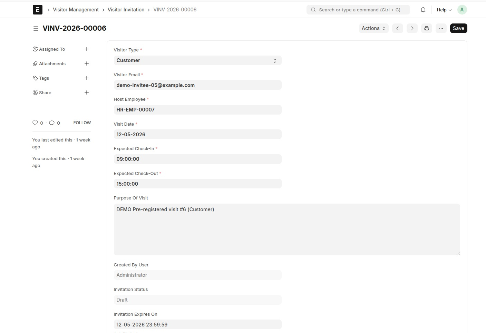
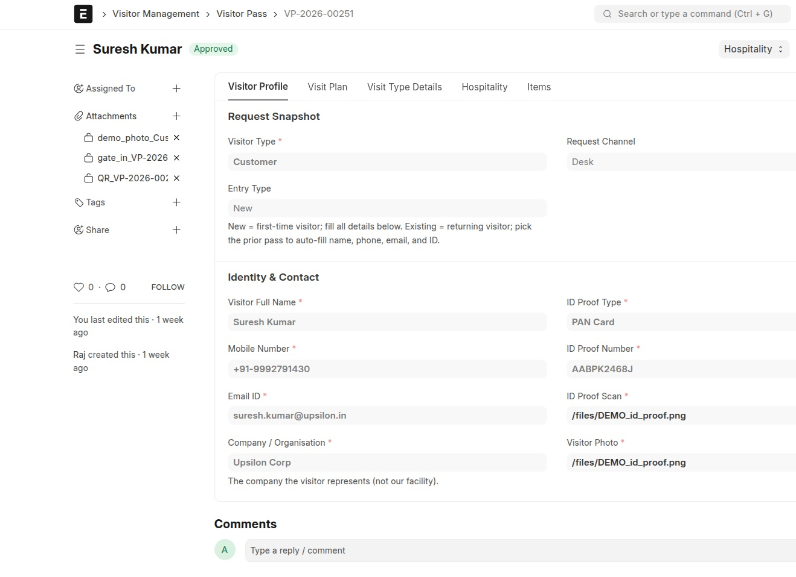
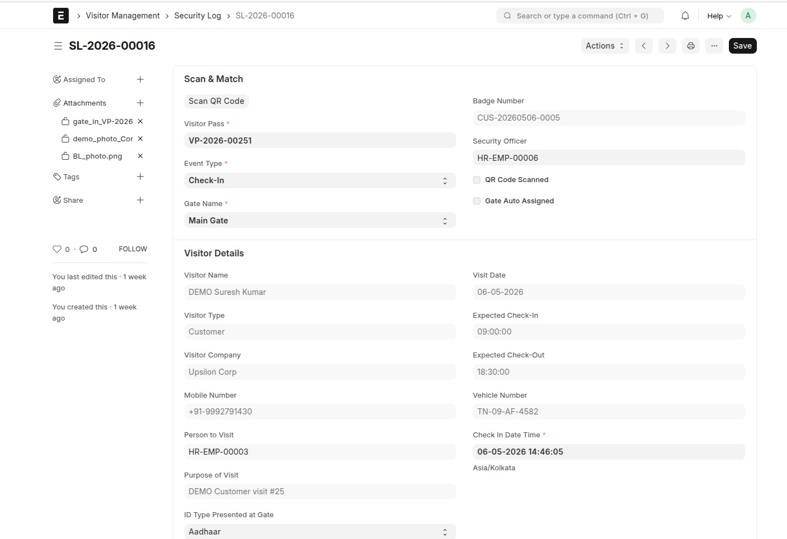
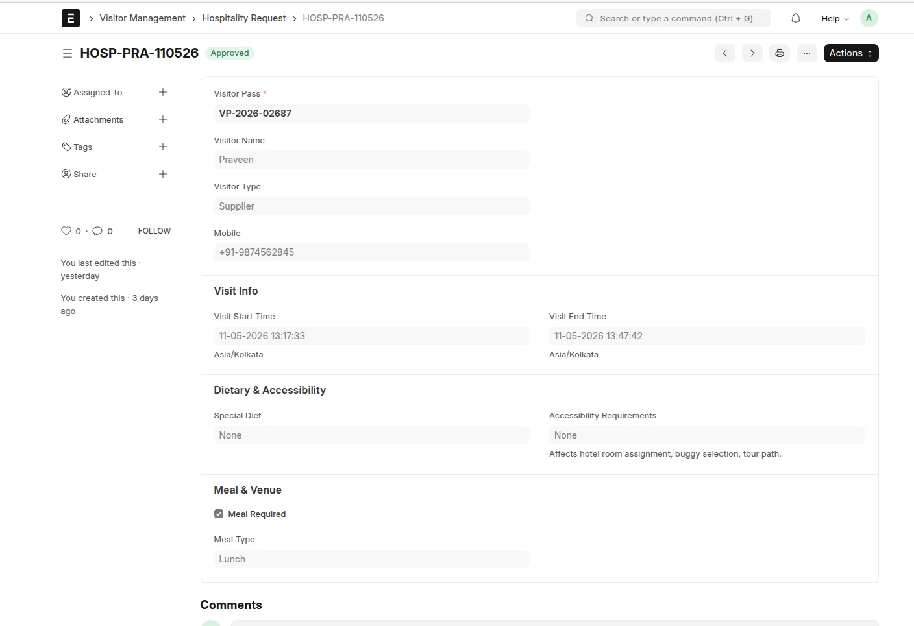
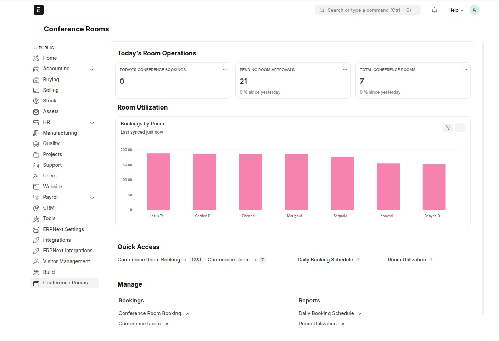

<div style="display: flex; justify-content: space-between; margin-bottom: 20px;">
    
    
</div>

---

# Visitor Management

Modern visitor lifecycle for offices, factories, and campuses — from pre-visit invitation, through QR-based gate check-in and identity verification, all the way to hospitality, conference rooms, contact tracing, and audit reports. Built on Frappe & ERPNext.

Frappe 15  ·  ERPNext 15  ·  Frappe HR (HRMS) 15  ·  license MIT  ·  English only

---

## Main features

**Visitor Lifecycle (invitation → approval → gate → checkout):** One Visitor Pass record drives the entire journey. Walk-in passes from reception or portal pre-registration via Visitor Invitation. Each **Visitor Type** names the role that approves it, and the approval workflow is generated from those settings.

**Approval is always by somebody else.** Nobody can approve a pass they created, sent for approval, or host — at either step of a two-step approval, and whichever way the approval arrives (the Actions menu, bulk approve from the list, the API).

**ID numbers are stored in full and shown masked.** Everyone sees `XXXX-XXXX-1234` or `XXXXXX345T`. Only a System Manager can view a full number, one record at a time, and every such view is recorded. ID scans and visa copies open only for Security, the visitor type's approvers and System Manager.

**Gate Security & Identity Verification:** A QR scan at the gate loads the pass. Which checks the officer must complete before recording the event — the QR scan, a live gate photo, **Matches ID Proof** and **Matches Pass Photo** — is decided in **VMS Settings** and enforced by the server (a new installation ships those three switches **off**; verifying every declared item ships **on**). The visitor is screened against the active **Visitor Blacklist** (an ID number match, or a name and mobile number matching the same entry). Nothing is recorded until the officer presses **Record Check-In** or **Record Check-Out**; the **Security Log** is then locked, and only a System Manager can correct one.

**A public pre-registration form with a privacy notice.** Invited visitors fill in their details, ID and photo before they arrive. The form shows your privacy notice and records, on the pass, that the visitor agreed, when, and to which version of the notice. Whether people without an invitation may use the form is a setting.

**Hospitality Management:** A Visitor Pass that asks for anything — a meal, refreshments, a cab, a hotel, a factory tour, a buggy, a greeting or a conference room — gets a **Hospitality Request**, which reaches the Hospitality Manager's queue when the pass is approved. Meal slots are worked out from the visit window and the meal windows you configure; cab pick-up and drop times start from the pass's expected check-in and check-out.

**Conference Room Booking:** If a room is selected on the pass, a **Conference Room Booking** is created for it. The meeting time is clamped to the room's operating hours, and seating capacity and clashes with other bookings are checked. A room that is already taken never holds up the pass: the pass goes ahead and says "Room Not Reserved".

**VIP Protocol:** An **Approved VIP Queue** quick-action on a new Security Log, email alerts to HOD and CEO as a VIP pass moves through approval, **protocol notes** and the meeting room carried from the pass to the gate, and a two-step approval (HOD, then CEO) out of the box.

**Contact Tracing & Audit Trail:** A Check-In or Gate Transfer opens a **Contact Trace Record** for the area the visitor entered and a Check-Out closes it. Gate events, no-shows and overstays are written to the **Visitor Event Log**, which only a System Manager can read or change.

---

## Before you install

These are the decisions this app makes on your behalf, and the things it needs from your site.
Read them before installing, not after.

### 1. Guest file uploads stay off — the portal does not need them

The visitor pre-registration form asks a not-logged-in visitor for a scan of their ID and a
photo of themselves (and a visa copy for a foreign visitor). The form reads those files **in
the visitor's browser** and sends them inside the form submission itself. The server then
checks each one — it must really be a JPG, PNG or PDF, judged by opening the file, not by its
name; at most 5 MB; and a picture of at most 50 megapixels — and stores it as a **private**
file attached to the new Visitor Pass, so it cannot be read by guessing a URL. A file that
fails is refused with a plain message, and nothing of a refused submission is kept.

So this app **does not switch on** the site-wide System Setting **Allow Guests to Upload
Files**, at install or on any migrate, and leaves it exactly as you have it.

If your site has that setting on for another app, a `File` `before_insert` hook
(`visitormanagement/visitor_management/portal_upload.py`, wired in `hooks.py` `doc_events`)
refuses any anonymous upload aimed at one of this app's records (a Visitor Pass, for example).
Anonymous uploads to anything else, and uploads by logged-in users, are left to Frappe as
usual.

### 2. The pre-registration page is public — you choose who may use it

The form lives at `/visitor-pre-registration-form` and the page answers anyone, logged in or
not. An invitation link opens it with the host's details filled in and locked.

Whether someone **without** an invitation may register is the setting **VMS Settings → Visit
Policy → Allow Pre-Registration Without an Invitation**:

- **Off** — the default on a new installation. The page tells a visitor without a link that
  an invitation is needed, and the server refuses such a submission.
- **On** — anyone who has the address (a QR code at reception, say) can register. A site
  upgraded from 1.0.0, where the form was always open, is switched **on** once so that nothing
  it relies on stops working; untick it to accept invited visitors only.

What limits the form either way:

- A registration made through the form always lands as a **Draft** Visitor Pass. Nothing
  reaches an approver, and nothing is valid at the gate, until someone on your staff opens the
  draft and sends it for approval.
- The page does not list your employees. A walk-in visitor types the name or work email of
  the person they have come to see. If that matches exactly one active employee, that person
  becomes the host; if not, the visitor gets the same answer and the pass is saved without a
  host, with a note of what was typed, for reception to complete. The form never says whether
  a name exists.
- It does not say whether an ID number is blacklisted or already has a pass that day either:
  an anonymous visitor gets one neutral refusal, while Security still gets the blacklist alert.
- A visitor cannot set anything that is for staff to decide — the VIP category, protocol
  notes, the interview panel, or links to a supplier, work order or job applicant — and
  without an invitation cannot ask for a meal or a meeting room.
- Calls are limited to 20 an hour per visitor address, and stored submissions to **Max Portal
  Submissions per Hour** (20 unless you lower it; you cannot raise it). Invitation look-ups
  are limited to 30 an hour, and after 20 wrong invitation links in an hour from one address
  every link from that address is answered as not valid. Meal-plan previews are limited to 60
  an hour for visitors who are not signed in, whichever API route the request uses; your own
  staff, working in the desk, are not counted. A host named on walk-in registrations is mailed about at most 5 of them an hour;
  the passes are still created.
- The page sends headers that forbid other sites from framing it and keep the invitation link
  out of the `Referer` sent to other sites.

Those three addresses — the form submission, the invitation look-up and the meal-plan preview
— are the app's only endpoints that work without a login.

**Behind a reverse proxy.** The per-address limits depend on the app knowing the visitor's
real address. It believes the `X-Forwarded-For` header only when the request reaches the app
server from a proxy: the same machine, a private or link-local address (10.x, 172.16–31.x,
192.168.x, 169.254.x, IPv6 `fc00::/7` and `fe80::/10`), or an address the server was told to
trust. That covers the standard bench set-up, Docker, Kubernetes and Frappe Cloud without any
configuration. If your proxy reaches the app server from any other address — carrier-grade
NAT space (100.64.0.0/10), or a public address — list it in the site configuration, as
addresses or networks:

```json
"trusted_proxy_ips": ["203.0.113.10", "100.64.0.0/10"]
```

When that key is present it is the whole list: only the same machine and the addresses you
name are believed. Set it also if your app server can be reached directly from an office
network, where a private address is not necessarily a proxy.

### 3. The app stores visitor identity data

Government ID numbers are kept in the database in full — the blacklist and duplicate checks
match on them — but they are shown masked to everyone, and reading one in full is a recorded
action open to System Manager only. Nothing is ever deleted or anonymised until you switch
the retention job on. The full account — what is stored, where, who can read and export it,
and what the retention job clears — is in [Data & privacy](#data--privacy) below. Have whoever
signs off on personal data read that section before the first real visitor is entered.

### 4. The app leaves Frappe, ERPNext, HRMS and every other installed app as they are

From 1.1.0 the app changes nothing it does not own:

- **No permission changes on other apps' DocTypes.** It adds no permission row to Employee,
  Supplier, Job Applicant, Maintenance Visit, Page or any other DocType outside its own two
  modules, so those DocTypes keep following their own app's permissions through every HRMS /
  ERPNext update.
- **No site-wide desk scripts, styles or logo.** It ships no `app_include_js` /
  `app_include_css`, and no `app_logo_url` (1.0.0 set one, which changed the navbar and login
  logo for the whole site). Its tile on the `/apps` screen keeps its own logo.
- **No site-wide tour.** Frappe 15 loads every "UI tour" on a site for every desk user on
  every page, whichever app it belongs to. The app ships none: its two guided form tours
  (Visitor Type, Visitor Invitation) are ordinary form tours, started only from the app's own
  onboarding block on its workspace.
- **No fixtures.** Roles, workflow states and workflow actions are created only when missing
  and never updated, so another app's "Approved" state or "Security" role keeps its own
  settings.

What it does add outside its own DocTypes, all of it removed again on uninstall:

- **Job Applicant** gets five fields under a "Visitor Invitation (Offline Interview)" section
  (interview mode, host, visit date, expected check-in and check-out). When HR saves an
  applicant with **Interview Mode = Offline**, the app creates a Visitor Invitation and emails
  the candidate the pre-registration link. With the default, Online, it does nothing. A failure
  in this step is logged and never blocks saving the applicant.
- **Two guards on files, which only ever refuse this app's own files.**
  One refuses anonymous uploads aimed at this app's records (see 1 above). The other keeps ID
  scans and visa copies to the people allowed to open them: a permission hook on File, and a
  check that runs when a private file is requested (an `auth_hooks` entry, because Frappe
  serves private files without consulting permission hooks). A request that is not for a
  private file returns at the first line; one that is costs a single indexed look-up and is
  left entirely to Frappe unless the file is an ID document attached to a Visitor Pass or
  Security Log. Neither guard ever grants access, and neither refuses a file of another app.
- **Security headers** on the pre-registration page's own route.
- **A one-time clean-up of its own history.** On the first migrate, the full ID numbers that
  Frappe's change history (Version) and its copies of deleted documents (Deleted Document)
  hold **for this app's own records** — Visitor Pass and Visitor Blacklist — are masked or
  removed. Rows of any other DocType are not read.
- **Frappe's personal-data requests** are told which of this app's fields hold a visitor's
  data (`user_data_fields`), so a Personal Data Deletion Request for an email address also
  covers that visitor's passes and invitations.

**What a site administrator may grant, optionally.** Inside the app's own forms, picking a
host, candidate, supplier or work order goes through the app's own search and needs no
permission on those DocTypes (see [Data & privacy](#data--privacy)). Some Frappe screens outside
the app's forms check permission on the linked DocType themselves, and the app does not work
around that:

| Where | Frappe check | To allow it |
|---|---|---|
| Filtering a Visitor Pass / Security Log / Hospitality Request / Conference Room Booking **list or report view** by an Employee, Supplier, Job Applicant or Maintenance Visit field (the filter's dropdown and its value check) | `frappe.desk.search.search_widget` → `frappe.get_list` → `DatabaseQuery.check_read_permission`, and `frappe.client.validate_link` (needs Select or Read) | Role Permission Manager → grant **Select** on that DocType to the role |
| Opening the linked Employee / Supplier / Job Applicant / Maintenance Visit itself from a pass | Frappe's normal Read check | Grant **Read** — only if that role should see the whole record |
| Customer passes: picking a Lead or Opportunity and pre-filling from it | Read on Lead / Opportunity (unchanged since 1.0.0; the app never granted it) | Grant **Read** on Lead / Opportunity to whoever raises Customer passes |

Granting any of these is the site's own decision: like any permission row, it moves that
DocType to Custom DocPerm, and the app never adds, changes or removes it.

**One thing never to grant:** permission level 1 on Visitor Pass or Visitor Blacklist. The
full ID number sits at that level precisely because no role holds it.

### 5. What the app needs from your site

- **ERPNext and Frappe HR (HRMS) must be installed.** Hosts, approvers and gate officers are
  Employee records. The app cannot be installed on a Frappe-only site.
- **An outgoing Email Account.** Invitations, approval mails with the QR code, host arrival
  alerts and blacklist alerts all go through the site's default outgoing Email Account. Without
  one, records still save and the gate still works, but no invitation reaches a visitor (the
  link can be copied from the invitation and sent by hand).
- **A camera and HTTPS at the gate.** QR scanning and the gate photo use the browser's camera,
  which browsers only allow on an HTTPS address.
- **India-first defaults, all editable.** A fresh install sets the home country to India, the
  phone country code to 91, and creates the ID types Aadhaar, PAN Card, Passport, Driving
  License and Foreign Passport. Change **Home Country** and **Default Phone Country Code** in
  VMS Settings, and edit or add **ID Proof Type** records, if you are somewhere else.
- **Disk space.** Each pre-registration can store up to three files of up to 5 MB (ID scan,
  photo, visa copy), plus a gate photo per check-in. They stay until the retention job is
  switched on or the records are deleted.

---

## Data & privacy

This section is written for a compliance officer. It describes what is on disk and what the
code does, not what is intended. [`PRIVACY.md`](PRIVACY.md) holds two templates — a notice you
can adapt for your own visitors, and a privacy policy for the publisher. They are starting
points for a lawyer, not legal advice.

### The app sends nothing to the publisher or to third parties

The app runs entirely on your site. It makes no outbound network connection of its own: no
telemetry, no licence check, no analytics, and the QR scanner library is bundled with the app
rather than loaded from a CDN. Visitor data leaves your database only in the emails listed
below, through your own mail server, and in whatever your own users export.

### What is stored, and where

| What is stored | Where | How |
|---|---|---|
| Visitor name, mobile number, email address, company, nationality | Visitor Pass, Visitor Invitation | Plain columns. The mobile number is also kept in a digits-only form for matching, and name and mobile are copied onto the visit's Security Log and Hospitality Request. |
| Photograph of the visitor (uploaded at pre-registration, and captured live at the gate) | File attachments on Visitor Pass and Security Log | Private files — not readable by URL guessing. |
| Government ID **type and number** — as shipped: Aadhaar, PAN, Passport, Driving Licence | Visitor Pass, and each accompanying visitor on a group pass | **Stored in full, in plain text, not encrypted — and never sent to a browser.** A second column holds the masked form, which is what every screen, list, report, email and print shows. The Security Log holds the masked form only. |
| Scan or photo of the ID document; visa copy for a foreign visitor | File attachments on Visitor Pass | Private files, open to a smaller audience than the pass itself (below). Never printed. |
| Accompanying visitors on a group pass — name, mobile number, ID type and number | Visitor Pass → Group Members | As for the main visitor. |
| That the visitor accepted the privacy notice, when, and which version | Visitor Pass → Privacy | Written by the public form only; a desk or API user cannot set it. |
| Vehicle number, items carried, purpose of visit, host | Visitor Pass, Security Log | Plain columns. |
| Dietary needs, allergies, accessibility requirements, hotel and cab details | Hospitality Request | Plain columns. |
| Movement history — every gate event, area entered and left | Security Log, Contact Trace Record, Visitor Event Log | A recorded Security Log refuses further edits from everyone except System Manager, who may correct one but not change which pass or which kind of event it records; Contact Trace Record and Visitor Event Log hold no permission for any role other than System Manager. |
| Blacklist entries — name, ID number, mobile number, reason | Visitor Blacklist | ID number stored in full and shown masked, as on the pass. Readable and editable by System Manager only, as shipped. |
| Candidate name, email and phone, when HR marks a Job Applicant's interview as Offline | Visitor Invitation | Copied from the Job Applicant. |

The Security Log also has fields for a body temperature and symptoms. They are hidden as
shipped and nothing fills them. If you unhide and use them you are recording health data, and
the Fever Threshold in VMS Settings then decides when a Contact Trace Record is marked high
risk.

### ID numbers: stored in full, shown masked, viewed on the record

The full number has to stay in the database: the blacklist, the duplicate-pass check and the
returning-visitor look-up compare whole numbers. It is **not encrypted** — anyone who can read
the database or restore a backup can read it. What changed in 1.1.0 is who can read it through
the application:

- **Everyone sees the masked number** — `XXXX-XXXX-1234` for Aadhaar, the last characters for
  every other type (`XXXXXX345T`). How many characters stay readable is **Visible Trailing
  Characters** on each ID Proof Type (0 to 6, default 4, never more than half the number).
- **The full number is not sent to any browser**: not on the form, in lists, reports,
  exports, the API, emails, prints or the change history. Lists cannot be filtered or sorted
  on it either, except by a System Manager.
- **A System Manager can view it** with **Show Full ID Number** on a pass, a group-member row
  or a blacklist entry. Each view is recorded twice: a note on the record's timeline, and a
  row in Frappe's **Activity Log**, which a System Manager can read but not edit or delete.
  Frappe clears Activity Log after the period in **Log Settings** — 90 days unless you change
  it — so lengthen that if you need the trail for longer; the timeline note stays with the
  record.
- **A number is typed, never read back.** Reception enters a number in an entry box; on save
  it is checked against the ID type's rule, stored out of sight, and the box is emptied.
- **On an approved pass the ID number is locked.** To correct it, cancel and amend the pass.
- **A deleted pass or blacklist entry no longer keeps its number.** Frappe's copy of a deleted
  document holds the masked form only, so restoring one brings the record back without its ID
  number, which must be typed in again.

### Who can open ID scans and visa copies

Only **Security**, **System Manager**, and the **approver roles of that pass's Visitor Type**.
Hosting the visitor, having raised the pass, or being able to read it is not enough — a host
sees the visitor's photo, which they need to recognise their guest, but not the ID scan. The
rule applies to the file itself, however it is requested, and to the copy of the scan shown
on the Security Log. The scan and the visa copy are also left out of every print and PDF of a
pass.

### Where visitor data appears outside the record

- **Emails.** The approval mail goes to the visitor with their QR code attached. Hosts are
  mailed when their visitor arrives, approvers when a pass waits for them, the hospitality
  roles a daily digest. When a blacklisted person is entered on a pass, an alert goes to the
  Security Alert Roles and the Admin Email with the visitor's name, **masked** ID number and
  mobile number. Frappe keeps copies of sent mail in the site's Email Queue, like any other
  email the site sends.
- **The QR code** holds the pass number, the visitor's name and the visit date. It does not
  hold the ID number.
- **Room bookings.** A booking created from a pass is titled "Visitor Meeting — *visitor
  name*". People who cannot open the booking see "Busy" on the calendar instead.
- **Record names.** A Hospitality Request is named after the first three letters of the
  visitor's name and the visit date (`HOSP-RAV-051026`).

### Who can read and export, as shipped

Access follows role permissions **and** a per-record rule, so a role alone is not the whole
answer:

| Record | Who sees which records |
|---|---|
| Visitor Pass | The person who raised it and the host; the approver role(s) of its Visitor Type; **Security**, once the pass is Approved or later; **Hospitality Manager**, only passes that ask for hospitality or have a request; **Facility Manager**, only passes that ask for a room or have a booking (both read-only, and without the ID scan); System Manager. |
| Visitor Invitation | The person who raised it and the host; approvers of its Visitor Type (read-only); System Manager. |
| Hospitality Request | Hospitality Manager and System Manager see all; anyone else sees those they raised, are assigned to, or whose visitor they host, plus any whose pass they can read. |
| Conference Room Booking | Facility Manager and System Manager see all; anyone else their own. |
| Security Log | Security and System Manager. A log cannot be recorded against a pass the officer is not allowed to read. |

Linking a Hospitality Request or a room booking to a Visitor Pass requires being able to open
that pass (Hospitality Manager and Facility Manager, whose work it is, are exempt) — so a
request cannot be used to read or change somebody else's pass.

**Who can export.** `export` on **Visitor Pass** ships for **System Manager only**. On a site
upgraded from 1.0.0, where nine roles had it, the first migrate removes it from the other
eight, once; if you grant it back to a role in **Role Permission Manager**, that decision is
kept. Still shipped with export: Security on Security Logs (which hold masked ID numbers
only); HR Manager and Sales Manager on Visitor Invitations; Hospitality Manager, HOD and CEO
on Hospitality Requests. Permissions the app grants itself at migrate are granted once, one
privilege at a time, and then belong to your Role Permission Manager.

**On other apps' records — Employee, Job Applicant, Supplier, Maintenance Visit — the app
grants nothing.** Its own forms pick a host, candidate, supplier or work order through the
app's own search, which shows a name and a label (an employee's department, a candidate's job
opening, a supplier's group) and never contact, salary, bank or ID data. It answers only users
who may create or edit the app record the field is on, honours their User Permissions unless
the app's field is marked *Ignore User Permissions*, and lists **Job Applicants** only to HR
Manager, HR User, Front Office Executive, System Manager and the Candidate visitor type's
approver role. A candidate's or supplier's phone and email are never sent to the browser:
reception types the visitor's own contact details. Note that HRMS's own **Employee** role reads
Employee records: give each employee user a User Permission to their own Employee (HRMS does
this when "Create User Permission" is ticked on the Employee) or every employee can read every
colleague's record.

### Telling visitors what you collect, and recording that they agreed

The public form shows a **privacy notice** above a tick-box the visitor must tick before the
form can be sent (**VMS Settings → Privacy Notice & Consent**).

- **Privacy Notice Text** is yours to write. Left blank, a standard notice is shown: what is
  collected, why, who sees it, and that the host can be asked about it. A web address in the
  text becomes a link, so you can point to your full policy.
- **Require Consent on the Public Form** is on by default, on new and upgraded sites alike.
  The server refuses a submission without the tick; it does not rely on the page.
- Each pass created through the form records **Privacy Notice Accepted**, the **time** (the
  server's clock) and the **notice version**. When you change the notice text the version is
  raised by one, unless you set your own reference. These three fields cannot be set from the
  desk or the API, and a pass raised by your own staff leaves them empty — reception is
  collecting the data in person and your own notice at the desk applies.
- **Footer Note** (Portal Branding) is still shown as plain text under the form and at the end
  of the invitation email, for a help contact or a short line of your own.

### Retention — off by default

The app ships a retention purge, and it is **off by default**. Nothing is ever anonymised or
deleted until an administrator opens **VMS Settings → Data Retention & Purge**, ticks **Enable
Data Retention Purge** and confirms the **Retention Period (days)** (which arrives pre-filled
with 365 but does nothing while the switch is off), and saves. Leave it off until your
compliance function has settled on a period.

Once it is on, a job runs nightly at 03:00 and works like this:

| | |
|---|---|
| **Which visits** | Only a visit that is over: a pass that is Checked-Out, Rejected, Cancelled or flagged No-Show, and an invitation that is Submitted, Expired or Cancelled — and only once its visit date is older than your retention period. Also a draft a visitor started on the public form that nobody sent for approval, 30 days after its visit date (or your retention period, if shorter). |
| **Cleared on the Visitor Pass** | Name, mobile number, email, company, ID number (stored, masked and entry fields), vehicle number, purpose of visit, items carried, protocol notes, special diet, hospitality notes, the links to a Job Applicant or CRM record, and the files: ID scan, visa copy, visitor photo, gate photo and QR code image. |
| **Cleared on the rest of the visit** | Accompanying visitors (name, mobile, ID number, remarks); declared items (name, description, serial number); the gate logs (name, company, mobile, masked ID number, vehicle, purpose, items, protocol and verification notes, their photos, and the item rows' names, serial numbers, remarks and photos); the Hospitality Request (name, mobile, diet, allergies, accessibility needs, notes, pick-up and drop points, hotel, booking reference, driver's name and phone); the room booking's title and instructions; the contact-trace notes; and the invitation (name, mobile, email, purpose, link and token). |
| **Cleared from the history** | The same values inside the records' change history, the notes the app wrote on their timelines, and the alert emails and notifications sent about them. |
| **What it keeps** | The visit itself: dates, host, gate, badge, workflow history, item categories and verification, and the record that the visitor accepted the privacy notice. Text your own staff typed about the meeting (meeting minutes, products discussed, interview panel, their own comments) is not parsed or cleared. Temperature and symptoms, if you use those fields, stay on the anonymised gate log. So "how many contractor visits last quarter" and the gate's own audit trail still answer correctly after the visitor's identity is gone. |
| **What it never touches, at any age** | **Visitor Blacklist.** A blacklist entry exists precisely to identify someone durably; anonymising it would quietly switch off blacklist matching for that person. |

It anonymises rather than deletes, which is what lets the statistics and the audit trail survive
the purge. Purged names are replaced with `[Purged — data retention]`. The job is batched and
safe to re-run, and a visit purged by an earlier version is picked up again for what that
version left behind.

**What still identifies a purged visit.** The name of its Hospitality Request keeps the first
three letters of the visitor's name; the Activity Log rows about full-ID views stay until
Frappe clears them; and anything in your **database backups** and in recipients' mailboxes is
outside the app's reach.

### Requests from individuals

- **Erasure or a copy for one person.** Frappe's **Personal Data Deletion Request** and
  **Personal Data Download Request**, raised for an email address, now cover that visitor's
  Visitor Passes and Visitor Invitations (matched on the visitor's email). They do not reach
  the gate logs, group members or hospitality requests of those visits: for a complete
  erasure, use the retention purge or clear those by hand.
- **Not implemented:** a visitor-facing way to make such a request, and withdrawal of consent.

If you operate under GDPR, India's DPDP Act or a similar regime, treat those as controls you
must add around the app.

### Uninstalling

Removing the app deletes its records and **permanently deletes every visitor's ID scan, photo
and visa copy** from disk. That is the right outcome for personal documents with no record left
to govern them, and it cannot be undone — take a backup first if you need the history.

---

## Installation

### On Frappe Cloud

Install the app on your site from the Frappe Cloud dashboard; there are no bench commands to
run, and Frappe Cloud runs the migrate for you on install and on every update. ERPNext and
Frappe HR must be on the site first. Then:

1. Set up an outgoing **Email Account**, or invitations will not be sent.
2. Open **VMS Settings** and work through [Setup and Use](#setup-and-use).
3. To remove the app, uninstall it from the site's dashboard. See
   [Uninstalling](#uninstalling) for what that deletes.

Everything else in this section is for a self-hosted bench.

### Prerequisites

| | |
|---|---|
| Frappe bench | on the `version-15` branch |
| **ERPNext v15** | required — declared in `required_apps`, bench refuses to install without it |
| **HRMS v15** | required — the Employee doctype is used for hosts and approvers |
| Python | 3.10 or newer |
| MariaDB | 10.6 or newer, InnoDB |
| Node | 18 (for `bench build`) |

Install ERPNext and HRMS on the site first if they are not there already:

```bash
bench --site <your-site> install-app erpnext
bench --site <your-site> install-app hrms
```

### Install

```bash
cd ~/frappe-bench
bench get-app --branch version-15 https://github.com/Yuvaraj4-S/Visitor_Management_System
bench --site <your-site> install-app visitormanagement
bench --site <your-site> migrate
bench build
bench restart
```

The repository is called `Visitor_Management_System`, but bench reads the package name from
`pyproject.toml` and puts it in `apps/visitormanagement` — which is why `install-app` takes
`visitormanagement`, not the repository name.

### Upgrade later

```bash
cd ~/frappe-bench/apps/visitormanagement
git pull
cd ~/frappe-bench
bench --site <your-site> migrate
```

Migrations are idempotent — `bench migrate` is safe to run any number of times. All setup
(roles, gates, visitor types, ID proof types, settings and the approval workflows) is applied
on migrate, and re-applying it does not overwrite a choice you have since made in the
Role Permission Manager.

### Upgrading from 1.0.0

Read this first. The migrate prints one line for each thing it changes; keep that output.

**Before you migrate**

- **Take a database backup** (`bench --site <your-site> backup`). The app's setup commits part
  of its work as it goes (index and column changes cannot share a transaction), so a migrate
  that fails halfway leaves some of it applied.

**What the first migrate decides for you, once — and how to change it**

- **The gate stays as strict as it was.** 1.0.0 demanded a QR scan, a gate photo and both
  identity confirmations on every Check-In and Check-Out, whatever VMS Settings said. 1.1.0
  obeys the settings, so on an upgraded site the three switches (**QR Scan Required at Gate**,
  **Require Visitor Photo**, **Block Check-In Without Verification**) are switched **on** for
  you. Untick any your gate does not need, in **VMS Settings → Gate & Security**. One thing is
  stricter than before: the gate refuses a Check-In or Check-Out while a declared item is
  unverified, unless you tick **Allow Gate Events Without Item Verification**.
- **The public form stays open.** **Allow Pre-Registration Without an Invitation** is switched
  on, as 1.0.0 behaved. Untick it to accept invited visitors only.
- **The public form starts asking for consent.** Visitors must tick the privacy notice before
  submitting. Review the notice text, or switch the requirement off, under **Privacy Notice &
  Consent**.
- **Only System Manager can export Visitor Passes.** The right is removed from the other eight
  roles that had it. Grant it back in Role Permission Manager where you need it; that is kept.
- **Permissions on HRMS / ERPNext DocTypes are handed back.** 1.0.0 gave eight roles
  Read on Employee, which copied Employee's whole standard permission set into Custom DocPerm
  and froze it, and put an Employee row on Page. The first migrate removes those rows
  (and the rows the Frappe 16 builds added on Supplier, Job Applicant and Maintenance Visit) —
  and only those: rows for roles the owning app grants itself, and any row you added, stay.
  Where what is left is exactly the DocType's standard set, the copy is dropped and the DocType
  follows its own app's permissions again; where you had customised it further, it is left as
  you made it and the migrate log says so. A permission you grant afterwards is never touched.
  If VMS users relied on those grants elsewhere in the desk, see
  [what a site administrator may grant](#4-the-app-leaves-frappe-erpnext-hrms-and-every-other-installed-app-as-they-are).

**What you should check afterwards**

- **Inactive blacklist entries.** In 1.0.0 a new entry was created with **Is Active**
  unticked, so it stopped nobody until someone ticked it. The migrate tells you how many
  entries are inactive and changes none of them — unticking is also how a person is cleared.
  Open Visitor Blacklist, filter on Is Active = No, and tick those that should be in force.
- **Blacklist entries with only a name.** A name alone, or a name and an ID type, now only
  warns. Add the ID number or the mobile number to an entry that must refuse entry
  (see [Visitor Blacklist](#visitor-blacklist)).
- **Integrations that send an ID number.** See [Notes for integrators](#notes-for-integrators).
- **Hospitality and Facility Managers** no longer see every Visitor Pass, only those their
  work is about. **Hosts** can no longer open the ID scan of their own visitors.
- **Job Applicant interview fields are renamed** to `custom_interview_checkin_time`,
  `custom_interview_checkout_time`, `custom_interview_host`, `custom_interview_mode` and
  `custom_interview_visit_date`. The first migrate copies every applicant's existing values
  into the new fields once; the old columns are left in the database, hidden. Reports, print
  formats or scripts of your own that read the old field names need updating.
- **Visitor Invitation → Purpose of Visit is now mandatory.** Existing invitations without one
  must have it filled in the next time they are saved.
- **The new limits in VMS Settings start at their defaults** (90 days ahead, 4 hours no-show
  grace, and so on) and cannot be switched off with a 0. If your site ran an earlier build of
  this version with **Max Advance Booking (days)** at 0, it now has a 90-day ceiling: enter
  the number you want.
- **Staff who raise or edit passes need the Employee role** as well as an approver role — see
  [Roles](#roles--who-does-what).

**What is tidied up for you**

- **ID numbers are masked everywhere, including in the past**: the masked form is filled in on
  existing passes, group members and blacklist entries, and the full numbers already written
  to the change history and to Frappe's copies of deleted passes and blacklist entries are
  masked or removed.
- **Gates and ID types are now records.** The five gate names 1.0.0 offered are created as
  **Visitor Gate** records, and its four ID types as **ID Proof Type** records. The free-text
  Gate List in VMS Settings is gone.
- **Invitations past their expiry are marked Expired**, and from now on an hourly job keeps
  them so.
- **A Conference Room that was created with no usable opening hours** (through the API or an
  import) is given 08:00–20:00; the migrate names each one.
- **The workspace tour "VMS Setup Tour" is removed**, if an earlier build of the app left it
  on your site, along with the progress users had recorded for it. Frappe ran it as a
  site-wide "UI tour", which could raise a script error on other apps' pages.
- **The Visitor Pass approval workflow is rebuilt** from your Visitor Types, once. If you had
  edited the "Visitor Pass Approval" workflow by hand, make those edits again afterwards; from
  then on they are kept.
- **Approval now needs a second person.** Nobody can approve a pass they created, sent for
  approval or host. If only one person holds an approver role, the passes they raise or host
  will wait: give the role to a second user (see [Roles](#roles--who-does-what)). Passes that
  were already waiting for approval before the upgrade are held to the same rule, using their
  creator and host.
- Old Visitor Item rows with the 1.0.0 category "Document / Sample / Gift / Perishable / Weapon
  / Other" become "Other"; a Visitor Invitation whose free-text Conference Room does not match
  a Conference Room record has it cleared (the migrate log lists each one). Duplicate
  invitation tokens, if any, are cleared on all but the oldest invitation — use **Send
  Invitation** on those to issue a new link.

### Uninstall

```bash
bench --site your-site uninstall-app visitormanagement
```

Besides the app's own DocTypes and records, the uninstall removes what the app added
elsewhere: the Job Applicant interview fields, its three workflows and its notifications, any
permission rows an earlier build left on Employee / Supplier / Job Applicant / Maintenance
Visit / Page that migrate has not already handed back (restoring those DocTypes' standard
permissions when nothing else was customised), the roles it created (unless another app's
permissions, reports, pages, workspaces, workflows or notifications still use them), its
scheduled jobs, the comments, versions, assignments, shares and emails attached to its records,
and every visitor's ID scan, photo and visa copy on disk. It does not touch
**Allow Guests to Upload Files** (this version never changes it), except on a site where an
earlier Frappe 16 build of the app recorded switching it on, which is switched back off. Roles
or settings that existed before the app are left alone. `--dry-run` changes nothing.

### Check it worked

Open **`/app/visitor-management`** — the Visitor Management workspace. The app also appears
as a tile on the `/apps` screen. The workspace opens with a six-step **onboarding block**
(review the settings, decide who approves each kind of visitor, a guided look at a Visitor
Type, name your gates, invite your first visitor, see who is on site), followed by 15 number
cards and seven charts.

This README is the authoritative installation reference. `docs/README.pdf` is the printable
manual from the 1.0.0 release and does not yet cover everything described here. The
screenshots below were also taken on 1.0.0; some forms have changed since.

---

## Setup and Use

System-wide configuration lives in **VMS Settings**; who approves what, and which badge and
gate a visitor gets, lives on each **Visitor Type**; how an ID number is checked and masked
lives on each **ID Proof Type**. Open the desk Awesome Bar and type the name. Only a System
Manager can change any of them, and changes to VMS Settings are kept in its change history.

### Configure VMS Settings

| Section | Field | What it does |
|---|---|---|
| General | **Admin Email** | Always receives blacklist alerts, in addition to the Security Alert Roles. |
| | **Home Country** | Visitors of any other nationality are treated as foreign nationals and must attach a visa copy. Default: India. |
| | **Food Dept Email** | Mailed when a pass with a meal is approved. |
| | **Default Checkout Time** | Expected check-out used when a pass or invitation gives none. Default 18:00. |
| | **Max Visit Duration (hrs)** | Longest visit window a pass may plan, and how long a visitor may stay Checked-In before security is alerted. Default 12. |
| Gate & Security | **Require Visitor Photo** | ✅ to require a live gate photo, taken or attached on that Security Log, on every Check-In and Check-Out. |
| | **QR Scan Required at Gate** | ✅ to require the visitor's QR code to be scanned. |
| | **Block Check-In Without Verification** | ✅ to require **Matches ID Proof** and **Matches Pass Photo** to be ticked on every Check-In and Check-Out. |
| | | *These three are off on a new installation and switched on, once, on a site upgraded from 1.0.0. The server enforces them, not only the form.* |
| | **Require Item Declaration** | ✅ to refuse approval of a pass that declares no items. Off as shipped. |
| | **Allow Gate Events Without Item Verification** | Leave unticked (the default) to require every declared item to be verified before a Check-In or Check-Out is recorded. |
| | **Blacklist Action** | What happens when a blacklisted visitor reaches the gate: **Block Entry** (default), **Alert Only** or **Log Only**. See [Visitor Blacklist](#visitor-blacklist). |
| Badge Configuration | **Enable Badge** | ✅ to issue badge numbers. Unticked, visitors get a QR code only. Which types get a badge, and its prefix and colour, is set on each Visitor Type. |
| Visit Policy | **Max Advance Booking (days)** | How far ahead a visit may be scheduled. Default 90. At least 1 day: there is no "no limit" setting, so enter a large number of days instead. A 0 that reached the database some other way is read as 90. |
| | **Invitation Link Expiry (days)** | Used only when an invitation has no expiry of its own. As shipped an invitation expires at the end of its visit date. Default 7. |
| | **No-Show Grace (hours)** | How long after the expected check-out an approved visitor who never arrived is flagged as a no-show. Default 4. |
| | **Default Phone Country Code** | Dialling code applied to local mobile numbers, without `+`. Default 91. |
| | **Fever Threshold (°C)** | Only relevant if you unhide the temperature field on the Security Log. Default 37.5. |
| | **Max Portal Submissions per Hour** | Pre-registrations stored per visitor address per hour. Default 20, which is also the ceiling. |
| | **Allow Pre-Registration Without an Invitation** | ✅ to let anyone who has the form's address register. Off on a new installation; switched on, once, on a site upgraded from 1.0.0. |
| Meal Windows | **Meal Windows** | The time slots a visit is compared against to work out its meals. Ships with Breakfast 08:00–09:00, Lunch 13:00–14:00, Dinner 20:00–21:30. |
| Notification Recipients | **Security Alert Roles** | Roles mailed on a blacklist match and on overstays. Empty means Security and System Manager. |
| | **Hospitality Digest Roles** | Roles mailed the 07:00 hospitality digest. Empty means the six hospitality roles. |
| Data Retention & Purge | **Enable Data Retention Purge**, **Retention Period (days)** | Off as shipped. See [Retention](#retention--off-by-default). |
| Portal Branding | **Brand Colour**, **Portal Logo**, **Organisation Name** | How the public pre-registration page looks. The logo is published as a public file so that logged-out visitors can load it. |
| | **Footer Note** | Plain text shown under the public form and in the invitation email. |
| Privacy Notice & Consent | **Require Consent on the Public Form** | ✅ (the default) to make visitors tick a box under the notice before they can submit. |
| | **Privacy Notice Text** | The notice shown above the box. Blank shows the standard notice. |
| | **Privacy Notice Version** | Recorded on each pass with the visitor's consent. Raised by one when you change the text; or set your own reference. |

Click **Save**.

**A zero never switches a limit off.** The form refuses 0 for Max Visit Duration, Max Advance
Booking, Invitation Link Expiry, No-Show Grace and the Retention Period. If a 0 or a negative
number is stored anyway — by an import, a script or an earlier build — the app reads it as
"not set" and uses the default: 90 days for Max Advance Booking, 7 days for Invitation Link
Expiry, 4 hours for No-Show Grace, 20 for Max Portal Submissions per Hour, and 12 hours for
the overstay alert. So a site that had Max Advance Booking at 0 to allow any date now has a
90-day ceiling until it enters a number. Two exceptions: with Max Visit Duration at 0 a pass
may plan a visit of any length (only the overstay alert falls back to 12 hours), and with the
Retention Period at 0 the purge does not run at all.

### Configure Visitor Types

A fresh install creates five: Contractor, Candidate, Customer, Supplier and VIP. Edit them or
add your own.

| Field | What it does |
|---|---|
| **Approver Role** | The role that approves passes of this type. Required. Its holders can also open the ID scans of this type's passes. |
| **Secondary Approver Role** | Optional second approval after the first. |
| **Badge Prefix**, **Badge Colour** | Badge numbers look like `CON-20261005-0001`. Shipped prefixes: `CON / CAN / CUS / SUP / VIP`. |
| **Default Gate** | The gate a visitor of this type is routed to. |
| **Requires Physical Badge** | Untick for QR-only access with no badge number. |
| **Issue Badge at Gate** | The badge number is issued at check-in instead of on approval. On for VIP as shipped. |
| **Requires Executive Notification** | The pass cannot be approved until **MD/CEO Notified** is ticked. On for VIP as shipped. |
| **Detail Layout** | Which extra section the pass shows: Supplier, Customer, Contractor, Candidate, VIP, or none. |

### Configure ID Proof Types

A fresh install creates Aadhaar, PAN Card, Passport, Driving License and Foreign Passport.

| Field | What it does |
|---|---|
| **Is Active** | Untick to stop offering this type. |
| **Valid for Foreign Nationals** | A visitor whose nationality is not the home country may only pick a type with this ticked. |
| **Aliases** | Other spellings accepted from the portal and imports, one per line (`PAN` for `PAN Card`). |
| **Validation Method**, **Validation Regex** | How a number is checked: a pattern, the Aadhaar checksum, or nothing. |
| **Normalisation** | How a number is tidied before it is stored (upper case, spaces and hyphens removed, and so on). |
| **Error Message** | Shown when a number fails the check. |
| **Visible Trailing Characters** | How many characters at the end of a number stay readable; the rest shows as X. 0 to 6, default 4, and never more than half the number. Aadhaar always uses the `XXXX-XXXX-1234` layout. |

A number is checked against these rules when it is entered or when its type changes — not on
every later save, so an old pass whose number no longer fits today's rule can still be edited.

Gates are **Visitor Gate** records (shipped: Main Gate, Back Gate, VIP Entrance, Loading Dock,
Emergency Exit). They can be added to or deactivated.

### Workflows

Three approval workflows are set up on install and on migrate — no setup needed. **Visitor
Pass Approval** is generated from the Visitor Types and rewritten only when their approver
roles change, so an edit you make to the workflow itself survives a migrate. **Hospitality
Request Approval** and **Conference Room Booking Approval** are created once and are then
yours.

**Who may not approve.** On a Visitor Pass, three people are too close to the visit to approve
it: whoever **created** the pass, whoever **sent it for approval** (recorded on the pass as
**Sent for Approval By**), and the **host** (Person to Visit). For them **Approve** is not
offered, a banner on the pass says why, and the server refuses the approval however it is
attempted. They can still **Reject** or **Cancel** — declining your own request is not
approving it. While a pass waits for approval, its host cannot change **Person to Visit**; an
approver who is not involved can. The Administrator account is exempt, as in Frappe's own
rule. On a Hospitality Request and a Conference Room Booking the rule is Frappe's standard
one: an approver cannot approve a record they created.

### Roles — who does what

The app ships **11 roles**. Assign them alongside Frappe's standard **Employee** role: the
everyday actions — raising a visitor pass or an invitation, requesting hospitality, booking a
room — are granted to `Employee`, and the roles below add the approval and operational rights
on top. A host must be an active **Employee**; link each user's login to their Employee record
so that the passes they host, and the requests assigned to them, show up as theirs.

**Anyone who raises or edits passes needs the Employee role as well** as their approver or
host role. It is `Employee` that can send a pass for approval and that can pick a **Visitor
Type** and a **Conference Room** on a pass (and, with Security, an **ID Proof Type**). An
approver who holds, say, Sales Manager or HOD without Employee can still open, approve,
reject and cancel the passes in their lane, without any error, but cannot fill in or change
those fields. On a pass they could otherwise edit, a one-line hint under Visitor Type, ID
Proof Type and Conference Room says that their role cannot list those records and whom to
ask.

| Role | Who it is for | What the role can do |
|---|---|---|
| **CEO** | Executive sign-off | Reads, edits, approves and cancels the Visitor Passes of the types it approves, and can open their ID scans. Ships as the **second** approver on the VIP lane. Reads the Hospitality Requests of those passes. Cannot create or delete either. |
| **Facility Manager** | Owns the meeting rooms | Full control of **Conference Room** and **Conference Room Booking** — create, edit, delete, and approve, reject, cancel or amend a booking. Opens only the Visitor Passes that ask for a room or have a booking, read-only and without the ID scan. |
| **Factory Tour Coordinator** | Runs plant and site tours | Receives the 07:00 daily hospitality digest so the day's tours are known in advance. Holds read on **Hospitality Request** — see the note under this table for which requests that opens. |
| **Front Office Executive** | Reception desk | Raises walk-in passes (through `Employee`) and can pick an existing **Supplier**, **Maintenance Visit** or **Job Applicant** on the matching pass layout (through the app's own picker — no permission on those DocTypes is needed or granted). Receives the daily hospitality digest. |
| **Greeting Staff** | Meets visitors on arrival | Receives the daily digest — who is arriving, and what greeting was requested. Holds read on **Hospitality Request** (see the note under this table). |
| **HOD** | Department head | Reads, edits, approves and cancels the Visitor Passes of the types it approves, and can open their ID scans. Ships as the **first** approver on the VIP lane. Reads the Hospitality Requests of those passes. |
| **Host Employee** | The person being visited | Creates, edits and submits **Hospitality Requests** for their visitors, and reads the Visitor Passes they host — with the visitor's photo, but not the ID scan. Can pick a host, Supplier or Maintenance Visit on a pass (Job Applicants are listed only to HR, reception and the Candidate approver). |
| **Hospitality Manager** | Owns cabs, hotels, meals and tours | Full control of **Hospitality Request** — create, edit, delete, approve, reject, cancel and amend. Opens only the Visitor Passes that ask for hospitality or have a request, read-only and without the ID scan. |
| **Hospitality User** | Hospitality team member | Receives the daily digest and can run the Daily Hospitality Schedule report. Holds read on **Hospitality Request** (see the note under this table). An execution role, not an approver. |
| **Security** | The gate | Records **Security Logs** — check-in, check-out, gate transfer, alert, badge collected — always in their own name. A log cannot be edited once recorded. Reads Visitor Pass (Approved and later) with the ID scan, and Visitor Gate, ID Proof Type and VMS Settings. **Read-only on Visitor Pass on purpose:** the gate acts through the Security Log, never by editing the pass. |
| **Transport Coordinator** | Cabs and drivers | Receives the daily digest with the day's pick-ups and drops. Holds read on **Hospitality Request** (see the note under this table). |

**Which Hospitality Requests a role can open.** Hospitality Manager and System Manager see
every request. Everyone else — including the four digest roles above — sees only the requests
they raised, are assigned to, or whose visitor they host, plus those of passes they can read.
So a Transport Coordinator or Greeting Staff member gets the day's schedule by email but, as
shipped, cannot open most of the requests listed in it.

**System Manager** is the only role that can view a full ID number, export Visitor Passes,
maintain the **Visitor Blacklist**, change settings and masters, and correct a recorded
Security Log.

**Approval routing is data, not code.** Each **Visitor Type** names the role that approves it,
and the Visitor Pass workflow is regenerated to match whenever you change one. The shipped
defaults are:

| Visitor Type | Approver | Second approver |
|---|---|---|
| VIP | HOD | CEO |
| Candidate | HR Manager | — |
| Customer | Sales Manager | — |
| Contractor | System Manager | — |
| Supplier | System Manager | — |

Point a Visitor Type at a different role and save it; the workflow lane, the approval email,
and the Approve and Cancel permissions follow at once — no migrate is needed. Only a System
Manager can change who approves a visitor type.

Two standard ERPNext roles are used as shipped approvers and are **not** created by this app:
**HR Manager** (Candidate lane) and **Sales Manager** (Customer lane).

**Give every approver role to at least two people.** An approver cannot approve a pass they
created, sent for approval or host. If the only holder of the role does any of those, the pass
waits — it is never approved automatically — and both the sender and the approver are told
that nobody else can approve it yet. The fix is to give the role to a second user.

---

## Pre-Visit Invitation — invite a visitor in advance

<p align="center"></p>
<p align="center"><em>Visitor Invitation — pre-registration link generated for the visitor</em></p>

1. Open the desk Awesome Bar and type "Visitor Invitation".
2. Click **+ Add Visitor Invitation**.
3. Fill: **Visitor Type**, **Visitor Email**, **Host Employee**, **Visit Date**, expected check-in and check-out, and **Purpose of Visit**.
4. Click **Save**, then **Send Invitation**. The visitor is emailed a link that only works for this invitation, until the end of the visit date. If the mail cannot be sent, the link can still be copied from the invitation.
5. The visitor opens the link, reads the privacy notice and ticks the box, and fills the form (mobile, ID type, ID number, photo, ID proof scan). They can save a draft and come back; the form then shows their ID number masked.
6. A **Visitor Pass** is created as a **Draft** and the host is emailed. The host (or reception) opens it, checks it, and sends it for approval.
7. An approver who did not create the pass, did not send it for approval and is not its host approves it. On **Approve** the pass is submitted, the QR code is generated and mailed to the visitor, and the hospitality request and room booking move forward if the pass asked for them.

An invitation that passes its expiry becomes **Expired** within the hour. Give it a later expiry and save, and it opens again where it left off.

## Walk-in Visitor — visitor is at reception

<p align="center"></p>
<p align="center"><em>Visitor Pass — Approved state with QR code and host details</em></p>

1. Open `/app/visitor-pass` and click **+ Add Visitor Pass**.
2. Fill: **Visitor Name**, **Mobile**, **Nationality**, **ID Proof Type**, the **ID Proof Number** (typed into the entry box; after saving only the masked number shows), **Visitor Type**, **Person to Visit**, **Visit Date**.
3. Tick hospitality needs if applicable (Meal Required, Cab Required, Hotel Required, etc.), and add accompanying visitors for a group.
4. Click **Save** — the pass is a Draft. A photo and an ID scan are needed before it can go further. Then use **Actions → Submit** to send it to its approver. If you hold the approver role yourself, you are told that somebody else has to approve it.
5. On **Approve** — by an approver other than the pass's creator, sender and host — the QR code is generated and mailed to the visitor, and hospitality and room booking move forward.

To correct a number on a draft, use **Change ID Number**. After approval the number is locked: cancel and amend the pass.

A visitor who registered themselves on the public form without an invitation appears as a Draft pass too. If the form could not match the host they named, **Person to Visit** is empty and a note on the pass says what they typed: set the host before sending the pass for approval.

## Gate Check-In — visitor arrives

<p align="center"></p>
<p align="center"><em>Security Log Check-In — gate photo, identity match, item verification</em></p>

1. Visitor presents their QR code at the gate.
2. Open `/app/security-log`, start a new log and click **Scan QR Code** (or use **Check In** on the Visitor Pass). A pass for another day, an unapproved or cancelled pass, or a blacklisted visitor on a site that blocks entry is refused here, before any checks are done.
3. The pass details load — visitor photo, ID scan, masked ID number, purpose, host by name, hospitality needs, items declared.
4. Click **Capture Gate Photo** to take a live photo, and tick **Matches ID Proof** and **Matches Pass Photo**. Attaching the photo does not record anything. Which of these, and the QR scan, are **required** is set in VMS Settings; the form marks them and the server enforces them.
5. Tick each declared item in the **Items Verification** grid as it is checked. As shipped, the event cannot be recorded while one is unticked, and removing an item's row does not get round that.
6. Press **Record Check-In**. A checklist shows anything still missing; otherwise the Visitor Pass becomes **Checked-In**, the host is emailed, and a Contact Trace Record opens. A badge number is issued here if the pass has none yet.

The Security Log is **locked once recorded**. Only a System Manager can correct one, and not which pass or which kind of event it records — for that, record a new event.

The system **re-checks the blacklist at the gate** even after pass approval — blacklisting may have happened in between. What happens on a match follows **Blacklist Action** (entry is refused, as shipped), the same on the scan, the buttons and the log itself.

A pass is good for its visit date, or for every day up to **Pass Valid Until** on a multi-day pass. A visitor who checks out and comes back inside that window is checked in again on the same pass.

## Gate Check-Out — visitor leaves

1. Visitor presents their QR code at exit.
2. Create a new Security Log with **Event Type = Check-Out** (or use **Check Out** on the Visitor Pass).
3. The same checks apply as at check-in, according to VMS Settings.
4. Press **Record Check-Out**. The Visitor Pass becomes **Checked-Out**, the open Contact Trace Record closes, and the visitor is sent a thank-you email. Record a **Badge Collected** event if you track badge returns.

Visitors who get blacklisted while still on premises are **allowed to check out** (the goal is to keep them out, not trap them in). A visitor still shown as inside after **Max Visit Duration** is reported to the Security Alert Roles; the app never checks anyone out by itself. A pass cannot be cancelled while its visitor is inside.

## Hospitality flow

<p align="center"></p>
<p align="center"><em>Hospitality Request — created from a pass that asks for hospitality</em></p>

A pass that asks for hospitality gets a Hospitality Request, which moves to `Pending Approval` when the pass is approved.

1. Open `/app/hospitality-request`.
2. Review meal type, cab pickup/drop, hotel dates, factory tour, greeting type, etc.
3. Fill in who delivers it — cab vendor, hotel, tour guide, buggy driver, greeting staff.
4. Click **Approve** → the request is Approved and submitted.

Cancelling an approved Visitor Pass calls off its hospitality request and its room booking.

## Conference Room flow

<p align="center"></p>
<p align="center"><em>Conference Rooms workspace — today's bookings, pending approvals, room utilization</em></p>

A pass with a Conference Room selected gets a Conference Room Booking, which moves to `Pending Approval` when the pass is approved. If the room is already taken, the pass still goes ahead and says **Room Not Reserved**: pick another room on the pass, or book one by hand. A Rejected or Cancelled booking does not hold its slot and does not show as Busy.

1. Open the **Conference Rooms** workspace — shows today's bookings, pending approvals, total rooms, and a **Bookings by Room** chart.
2. Open the pending booking and review the time window (clamped to room operating hours) and seating capacity.
3. Click **Approve** → booking becomes Approved + Submitted.

---

## Track every visit

Every visitor's journey is captured across three audit doctypes:

| Doctype | Captures |
|---|---|
| **Visitor Event Log** | One line per gate event, plus the automatic ones — no-show and overstay flags, retention purges. Readable and editable by System Manager only. |
| **Security Log** | Every gate event — Check-In, Check-Out, Gate Transfer, Alert, Badge Collected. Photo at gate, identity match, item verification, gate, and the officer and host by name. Locked once recorded. |
| **Contact Trace Record** | Per visitor area-by-area movement log — visited area, time in, time out. Closes on Check-Out. |

Click **Visitor Pass → Connections** on any pass to drill into all linked records.

## Identity verification at the gate

The Security Log can enforce four checks on Check-In and Check-Out. Each is a switch in
**VMS Settings → Gate & Security**, enforced by the server when the event is recorded:

| Check | Required when this is ticked | New installation | Upgraded from 1.0.0 |
|---|---|---|---|
| Visitor's QR code scanned | QR Scan Required at Gate | Not required | Required |
| Live photo at gate, taken or attached on that log | Require Visitor Photo | Not required | Required |
| Visitor matches the ID proof presented, and matches the photo on the approved pass | Block Check-In Without Verification | Not required | Required |
| Every declared item verified | *unless* Allow Gate Events Without Item Verification is ticked | **Required** | **Required** |

A required check that is missing stops the event from being recorded. The gate photo cannot be the visitor's own pre-registration photo or ID scan pasted in: it must be a file uploaded for that log. The pass photo, ID proof scan, and live gate photo are shown side-by-side in the **Identity Comparison** section.

---

## Multi-Gate Routing

When a Security Log has no gate chosen, it is assigned the **Default Gate** of the visitor's type:

| Visitor Type | Default Gate, as shipped |
|---|---|
| VIP | VIP Entrance |
| Supplier | Loading Dock |
| Contractor | Back Gate |
| Candidate | Main Gate |
| Customer | Main Gate |

Change the gate on a **Visitor Type** to re-route that type, or pick a different gate on the individual Security Log. A type with no default gate falls back to the first active Visitor Gate. A deactivated gate cannot be used for a new gate event.

---

## Visitor Blacklist

| Field | What to put |
|---|---|
| **Visitor Name** | The person's name. |
| **ID Proof Type** | One of your ID Proof Types. It decides how the number is tidied and masked; it is not matched on. |
| **Enter ID Proof Number** | Type the full number here. It is stored out of sight on save; the entry then shows the masked number. One active entry per number (entries are named `VB-YYYY-#####`). |
| **Mobile Number** | Needed if you want to refuse someone whose ID number you do not have. At least 7 digits. |
| **Reason** | Mandatory — why this person is blocked (audit/compliance requirement) |
| **Is Active** | ✅ to enforce the block. Uncheck to suspend the block without deleting the record. |

An entry needs an ID number, or a name, or a mobile number. One that cannot refuse entry by
itself — a name alone, or a mobile number alone — is saved, and tells you so.

**What blocks, and what only warns:**

| The visitor matches an active entry on… | Result |
|---|---|
| **ID Proof Number** (compared ignoring case, spaces, hyphens and slashes) | Blocked. |
| **Visitor Name and Mobile Number**, both on the same entry | Blocked. |
| Name alone, or mobile number alone | **Not blocked.** A warning names the entry and asks the person at the desk or gate to verify the ID. |

A name is not enough to refuse someone: too many people share one.

The blacklist is checked when a Visitor Pass is saved as a draft (a warning), when it is sent
for approval and again when it is approved (a block, with an alert email to the Security Alert
Roles), for each accompanying visitor on a group pass, and at the gate — on the QR scan, on
the **Check In** button and when the Check-In is recorded. At the gate the **Blacklist Action**
setting decides what a match on the first two rows means: **Block Entry** refuses the
check-in, **Alert Only** warns the officer and lets it through, **Log Only** lets it through
and records the match in the Error Log.

---

## Reports

Seven reports are pre-installed. Each shows a reader only the records they are allowed to see.

| Report | Source DocType | Use | Who can run it, as shipped |
|---|---|---|---|
| **Active Visitors** | Visitor Pass | Visitors currently on premises, with host by name | System Manager, Security, Host Employee |
| **Daily Visitor Log** | Visitor Pass | One row per pass: first check-in, last check-out, number of entries, host by name | System Manager, Security, Host Employee |
| **Gate Wise Count** | Security Log | Check-in / check-out / inside / pending counts for every active gate | System Manager, Security |
| **Visitor Identity Match Report** | Visitor Pass | Passes that share an ID, mobile or email, with the ID number masked | System Manager |
| **Daily Hospitality Schedule** | Hospitality Request | Today's cab / hotel / tour / greeting schedule | Hospitality Manager, Hospitality User, System Manager |
| **Daily Booking Schedule** | Conference Room Booking | Today's room bookings | System Manager, Facility Manager, Employee |
| **Room Utilization** | Conference Room Booking | Per-room utilization summary | System Manager, Facility Manager |

Print formats: **Visitor Badge** and **Visitor Itinerary**, which name the host and staff by name. Neither prints the ID scan, the visa copy or the full ID number.

---

## Notes for integrators

For anyone who creates or reads the app's records through the REST API, a script or Data
Import.

**ID numbers**

- To set or change a number, send it in **`id_proof_number_entry`** (on a Visitor Pass, a
  group-member row or a Visitor Blacklist entry). The server checks and stores it and returns
  the masked value in `id_proof_number_masked`.
- `id_proof_number` is accepted **when a record is created**, for older callers, and treated
  as if it had been sent in the entry field. On an **update** — Data Import updates included —
  it is ignored; only the entry field changes a number.
- No read returns the full number: `id_proof_number` is absent from every API response.
  Filtering or sorting Visitor Pass on it is refused unless the caller is a System Manager.
- On an approved pass the number cannot be changed.
- A full number is read with
  `visitormanagement.visitor_management.id_masking.reveal_id` (POST; `doctype`, `name`,
  optional `fieldname` and `row_name`). System Manager only, and every call is recorded.
- Do not grant permission level 1 on Visitor Pass or Visitor Blacklist to any role.

**Approval**

- An approval is refused for the pass's creator, the user who sent it for approval and its
  host, whether it arrives as a workflow action, a bulk action or a plain submit. The error
  is a permission error titled "Another Approver Needed". Administrator is exempt.
- `submitted_for_approval_by` is set by the server when a pass enters an approval lane; a
  value sent for it is discarded.

**The gate**

- `visitormanagement.visitor_management.api.visitor_gate.visitor_checkin`, `visitor_checkout`,
  `scan_qr_checkin` and `get_gate_context` decide whether a movement is allowed and return
  the Security Log to open. They do **not** record anything. A pass the caller may not read
  gets one answer, whatever its state.
- A gate event is recorded by creating a **Security Log**. The caller needs create permission
  on Security Log and read permission on the pass; the three gate switches, the item
  verification and the blacklist are enforced on insert; the officer is always the caller
  (unless a System Manager names one); and when a gate photo is required it must be a file
  uploaded for that log, or the caller's own upload that is not yet attached to anything.

**The public form**

- `visitormanagement.visitor_management.portal.submit_pre_registration` takes the three files
  as data URIs inside the payload, `consent_given` when consent is required, and — without an
  invitation — the host as free text in `person_to_visit`. It needs an `invitation_token`
  unless walk-in registration is switched on.
- Behind a reverse proxy, see [`trusted_proxy_ips`](#2-the-pre-registration-page-is-public--you-choose-who-may-use-it).
- The meal-plan preview has two methods in `visitormanagement.visitor_management.lifecycle`:
  `get_hospitality_meal_plan` is the public one (rate-limited for callers who are not signed
  in), and `get_meal_plan_for_pass` is the one the desk uses (login required, not
  rate-limited).

**Other**

- A **Conference Room** created through the API or an import without opening hours gets
  08:00–20:00.
- The few site settings the Visitor Pass form needs — home country, phone country code,
  whether badges are on, and which ID types a foreign visitor may present — are served by
  `visitormanagement.visitor_management.doctype.visitor_pass.visitor_pass.get_pass_form_settings`
  to anyone who can read Visitor Passes. VMS Settings itself is not opened to them.
- The privacy-consent fields on Visitor Pass (`consent_given`, `consent_timestamp`,
  `consent_notice_version`) are written by the public form only; a value sent for them is
  discarded.
- Markup is stripped from the plain-text fields a visitor can fill in. On an approved pass the
  two text fields that can still change, `current_location` and `assigned_meal_slots`, are
  stored as plain text as well; `hospitality_notes` is a formatted field and keeps its
  formatting, with scripts removed by Frappe's own sanitiser.

---

## Limitations

- **Badge returns are not tracked automatically.** A badge number is issued on approval or at the gate; nothing marks it returned at check-out. Record a **Badge Collected** gate event if you need that trail.
- **Recurring visitors** are tracked one Visitor Pass per visit. There is no cross-visit aggregation (e.g. "contractor X visited 12 times this year" requires a custom report on top of the Visitor Pass table).
- **NDA capture** is not implemented.
- **A two-step approval can be taken by one person.** Nobody involved in a visit can approve it, but one uninvolved person who holds both approver roles of a two-step lane (HOD and CEO, as shipped for VIP) can take both steps. If two different people must sign, do not give both roles to the same user.
- **A pass waits when nobody else can approve it.** If the only holder of an approver role created, sent or hosts a pass, it stays pending until a second user is given the role.
- **Hospitality Requests and room bookings use Frappe's simpler rule**: an approver cannot approve a record they created, but the wider "not the sender, not the host" rule applies to Visitor Passes only.
- **Any employee who can raise a pass can look up colleagues' names and departments** through the host picker — every employee has to be pickable as a host. No contact, salary or ID data is shown. **VMS Settings is readable by every employee** (it holds no secrets).
- **Per-address limits on the public form are shared by everyone behind one address.** A reception kiosk or tablet that registers many walk-ins an hour will meet the 20-an-hour limit.
- **ID numbers are masked, not encrypted.** Anyone with database or backup access can read them.
- **Privacy tooling is partial.** Consent is recorded and a retention purge exists, but the purge ships switched off, there is no visitor-facing way to ask for a copy or erasure, and consent cannot be withdrawn through the app — see [Data & privacy](#data--privacy). Until the purge is enabled, visitor records remain until manually deleted.
- **The record of who viewed a full ID number** lives in Frappe's Activity Log, which Frappe clears after 90 days unless you lengthen that in Log Settings.
- **"QR Code Scanned" is the form's word.** The tick is set by the gate terminal's scanner; the server checks that it is set, not that a scan took place.
- **A Hospitality Manager picking a pass that asks for no hospitality** may see a permission message while the form fetches the visitor's details; the details are filled in when the request is saved.
- **Digest roles cannot open most Hospitality Requests** — see [Roles](#roles--who-does-what).
- **Items-out reconciliation** (verifying the visitor leaves with the same items they brought in) is not enforced — only items-in is verified.
- **English only.** Screen text can be translated through Frappe in the usual way, but no translations are shipped and email subjects are not translatable.
- **Currency / localisation** — date formatting follows the site's Frappe locale; the shipped ID types and phone defaults are Indian and need editing elsewhere.

---

## Dependencies

- Frappe v15
- ERPNext v15
- HRMS v15 (Employee doctype used for visitor host links)
- Python 3.10+
- MariaDB 10.6+ with InnoDB

Python packages: `qrcode` with Pillow (declared in `pyproject.toml`) and `phonenumbers` (ships
with Frappe).

---

## Running the tests

For developers. **Never run the test suite against a site that holds real data.**

```bash
bench --site <test-site> set-config allow_tests true
bench --site <test-site> run-tests --app visitormanagement --skip-before-tests --skip-test-records
```

The suite has 435 tests. Keep both `--skip` flags on any site that is shared or not a
throw-away: without them Frappe creates test records for linked DocTypes on the site. The
suite creates the staff it needs — no Employee and no user holding the app's roles has to
exist on the site — inside the tests' own database transaction, so they are gone when the
tests end; a site that has real staff is tested with them. A few gate tests still skip themselves on a site with no
Company, so read the `skipped=` figure in the summary before trusting a green run. The suite
needs no extra Python packages.

---

## Support & security contact

> **Publisher: the entries marked `[PUBLISHER TO FILL]` are placeholders. Replace them before
> this README is published on the Marketplace listing.** The email address below is the one
> currently set as `app_email` in `hooks.py`; it is one person's mailbox, and a role mailbox
> that survives staff changes is recommended for support and for security reports.

| I want to… | Go here |
|---|---|
| **Report a bug** | Open an issue at **https://github.com/Yuvaraj4-S/Visitor_Management_System/issues** — include your Frappe, ERPNext, HRMS and app versions (`bench version`), the exact steps, and the traceback from **Error Log** if there is one. Do not paste visitor names, ID numbers or screenshots of real passes. |
| **Ask a question, or ask for help setting it up** | Email **yuvaraj.s@finstein.ai** (current contact). `[PUBLISHER TO FILL: support URL or support mailbox]` |
| **Report a security problem** | Follow [`SECURITY.md`](SECURITY.md). Email **yuvaraj.s@finstein.ai** (current contact) — `[PUBLISHER TO FILL: security mailbox]`. Please do **not** open a public issue for a security report. |
| **Ask about personal data** | Your visitors' data is held on your site, not by the publisher — see [Data & privacy](#data--privacy). The publisher's own privacy policy: `[PUBLISHER TO FILL: privacy policy URL]` |
| **Read the source, or track what changed** | Source: https://github.com/Yuvaraj4-S/Visitor_Management_System · Changes: [`CHANGELOG.md`](CHANGELOG.md) |

Issues are the fastest route for anything reproducible; email is better for anything that
would expose your data or your site.

---

## Third-party components

This app bundles **html5-qrcode** (Apache-2.0) for camera QR scanning at the gate, and depends
on `qrcode`/`Pillow` for QR generation. Full attribution and licence text:
[`THIRD_PARTY_NOTICES.md`](THIRD_PARTY_NOTICES.md).

---

## License

MIT — see `license.txt`.

---

<p align="center"><strong>Built with Frappe&nbsp; . &nbsp;by Finstein</strong></p>
 
<p align="center">
  
  &nbsp;&nbsp;&nbsp;&nbsp;&nbsp;&nbsp;
  
</p>
