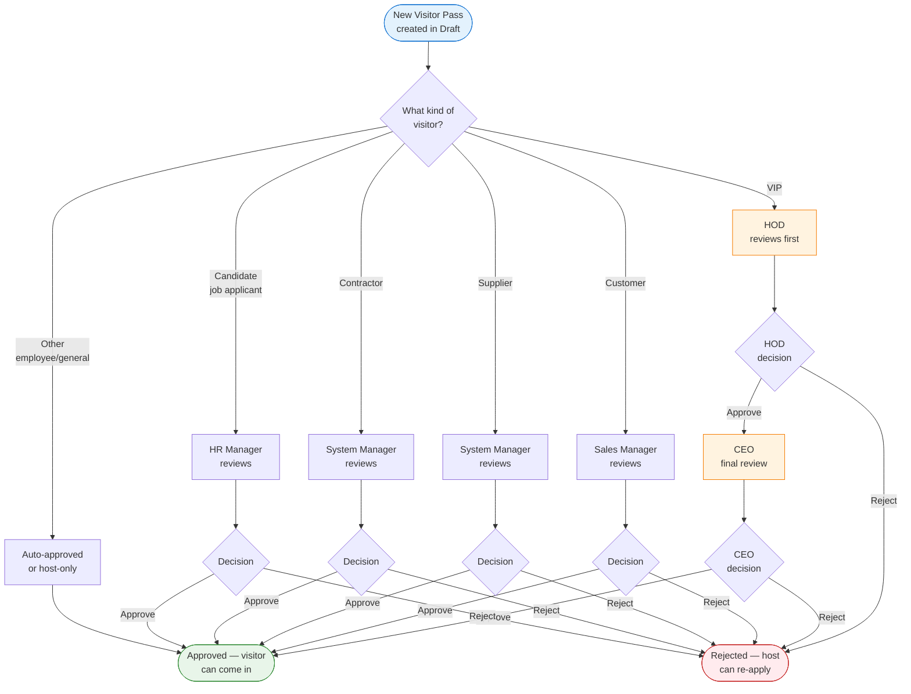
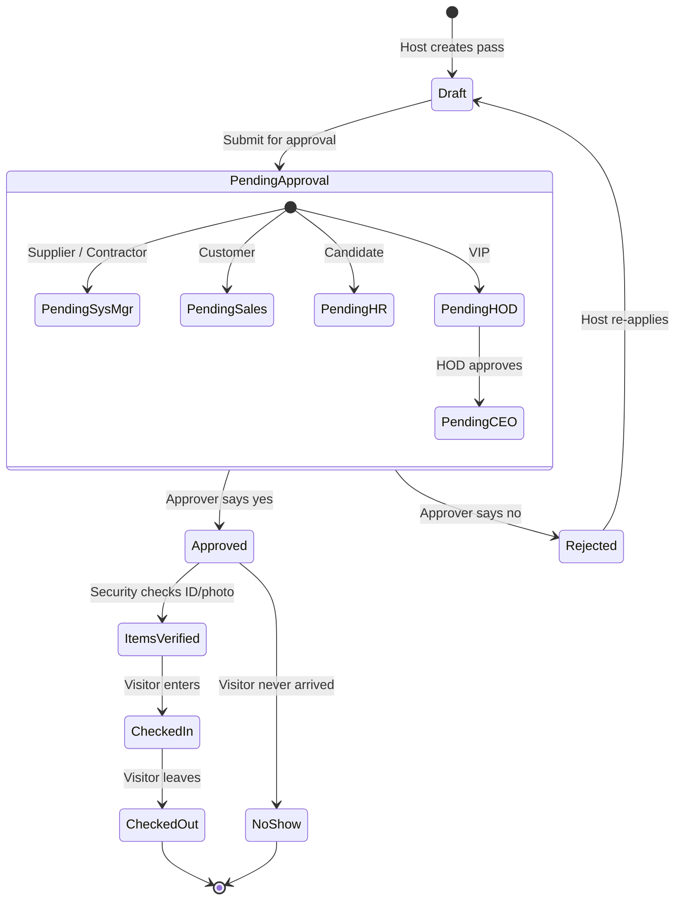
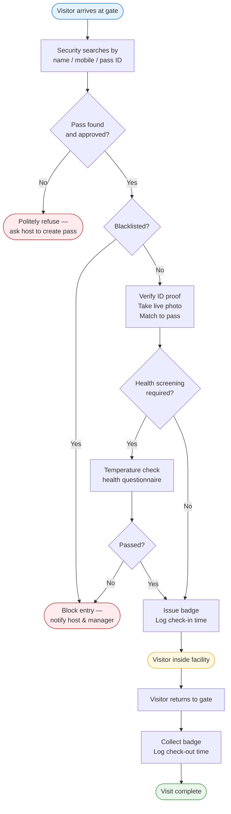
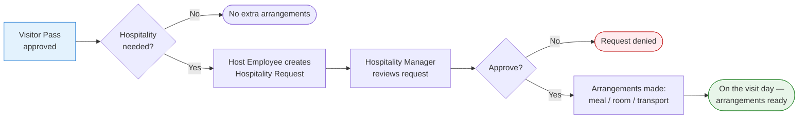
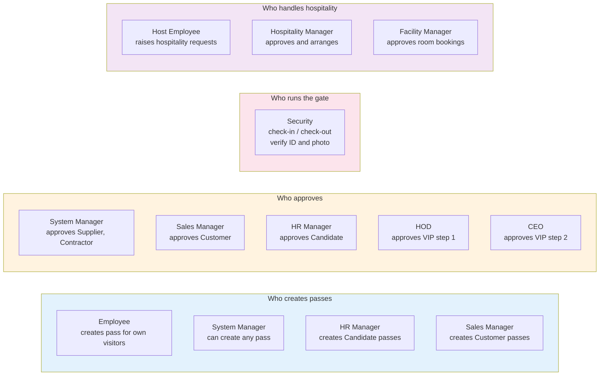
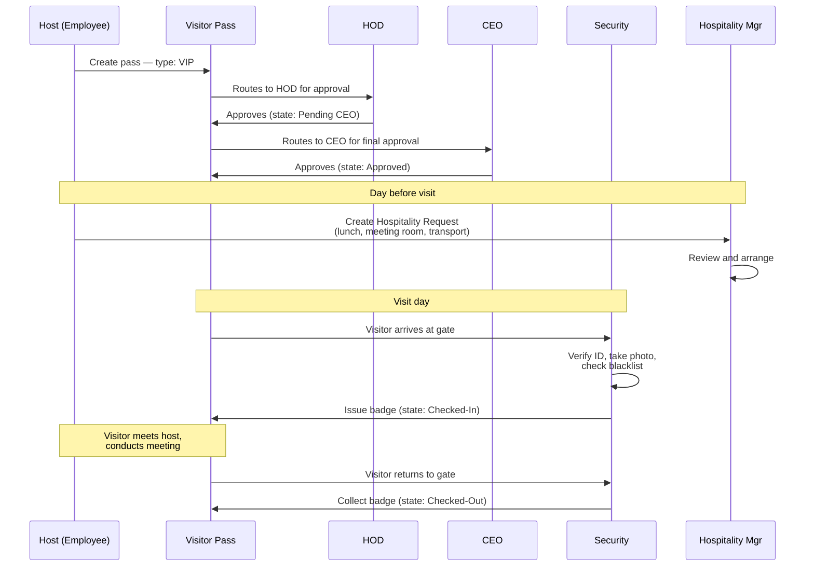

# Visitor Management System — How It Works

A visual guide for the whole company. Read top-to-bottom; no prior knowledge needed.

---

## 1. The Big Picture — A Visitor's Journey

This is what happens from the moment someone wants to visit your facility, to the moment they leave.

```mermaid
flowchart LR
    A([Someone needs<br/>to visit]) --> B[Host sends invitation<br/>OR Front Desk creates pass]
    B --> C{Approval<br/>required?}
    C -- Yes --> D[Goes to the right<br/>approver based on<br/>visitor type]
    C -- No --> E
    D --> E[Pass is approved]
    E --> F[Visitor arrives<br/>at the gate]
    F --> G[Security verifies<br/>ID, photo, blacklist]
    G --> H{Cleared?}
    H -- No --> X([Entry refused])
    H -- Yes --> I[Badge issued<br/>Visitor checks in]
    I --> J[Visitor meets host<br/>conducts business]
    J --> K[Visitor returns<br/>to gate]
    K --> L[Security checks out<br/>Badge returned]
    L --> Z([Visit complete])

    style A fill:#e3f2fd,stroke:#1976d2
    style Z fill:#e8f5e9,stroke:#388e3c
    style X fill:#ffebee,stroke:#c62828
    style D fill:#fff3e0,stroke:#f57c00
    style G fill:#fff3e0,stroke:#f57c00
```

---

## 2. Who Approves What — Routing by Visitor Type

Different kinds of visitors go to different approvers. The system figures this out automatically based on the **visitor type** you pick when creating the pass.

**Rule of thumb**: VIPs get two-level approval (HOD then CEO). Everyone else needs one approver. The right approver is picked automatically based on the visitor type.

---

## 3. The Workflow States — Where Is My Pass Right Now?

Every Visitor Pass moves through these states. The colour tells you the situation at a glance.

---

## 4. At the Gate — What Security Does

This is the operational front-line flow. Security is the gatekeeper.

---

## 5. Hospitality Side — When Visitors Need More Than a Badge

When a visitor needs lunch, a meeting room, transport, or a guided tour, a **Hospitality Request** runs alongside the visitor pass.

---

## 6. The Roles — Who Does What

A simple cheat-sheet of who can do what in the system.

---

## 7. A Real-World Example — VIP Visit, Step by Step

To make it concrete, here is one full journey for a VIP visit.

---

## 8. Quick Glossary

| Term | What it means |
|---|---|
| **Visitor Pass** | The main document. Tracks one visit from creation to check-out. |
| **Visitor Type** | Customer, Supplier, Contractor, Candidate, VIP, etc. Decides who approves. |
| **Host** | The internal employee the visitor is coming to meet. |
| **Approval Workflow** | The automatic routing of the pass to the correct approver. |
| **Security Log** | Each check-in and check-out is recorded as a separate Security Log entry. |
| **Hospitality Request** | A side-document for lunch, rooms, or transport. Optional. |
| **Blacklist** | A list of people not allowed entry. Checked at the gate. |
| **Badge** | The physical pass given at check-in, returned at check-out. |

---

## 9. The One-Page Summary

If you remember nothing else, remember this:

1. **Host or front desk creates the pass.**
2. **System routes it to the right approver based on visitor type.**
3. **Approver says yes or no.**
4. **Security verifies the visitor at the gate.**
5. **Visitor checks in, does their business, checks out.**
6. **Hospitality runs in parallel if extras are needed.**

That's the whole system.
